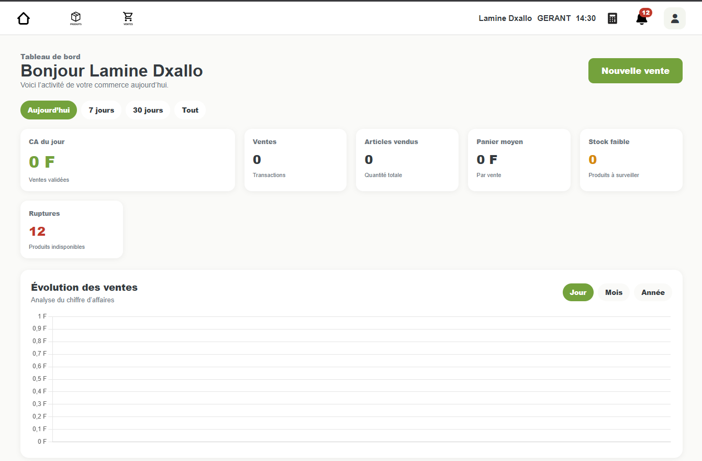
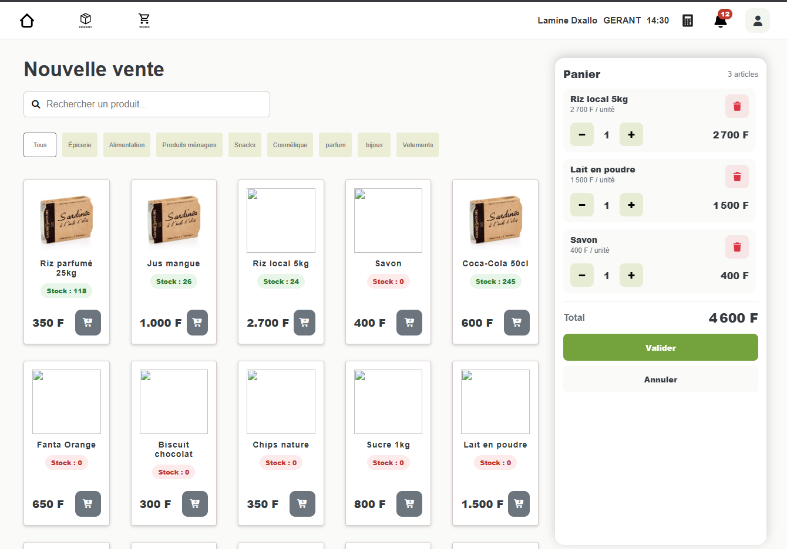
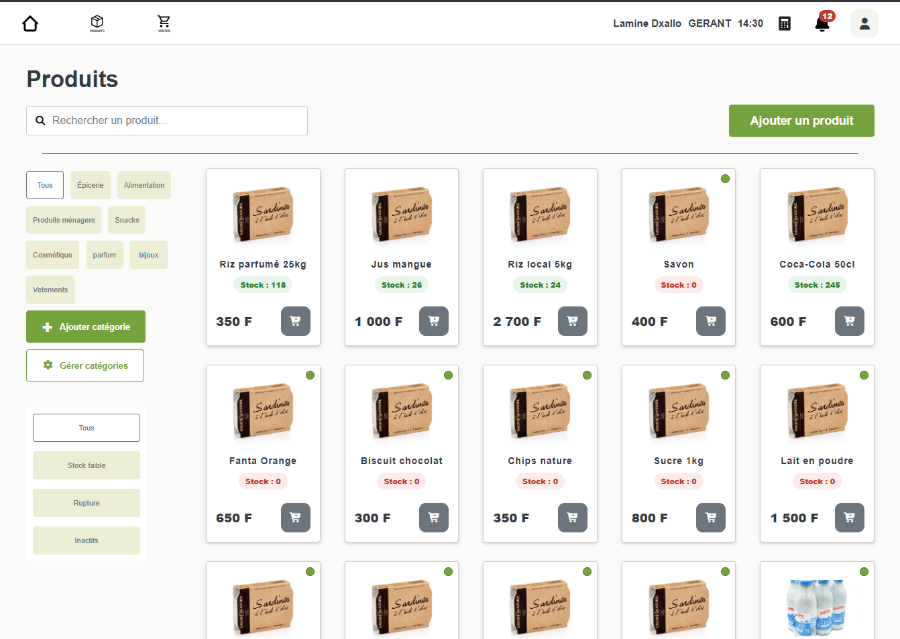
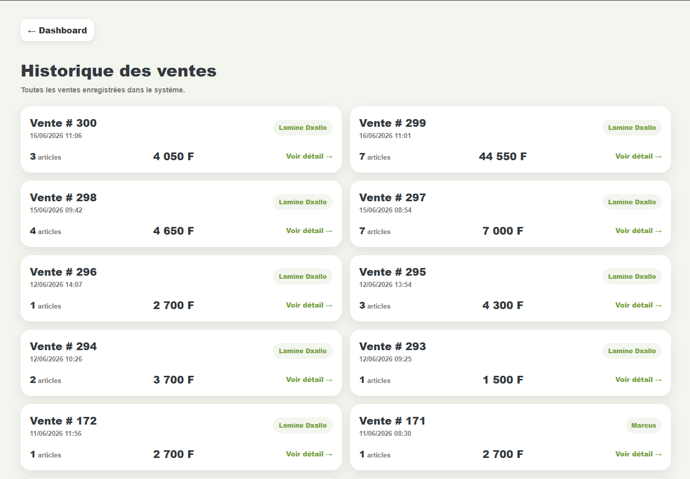
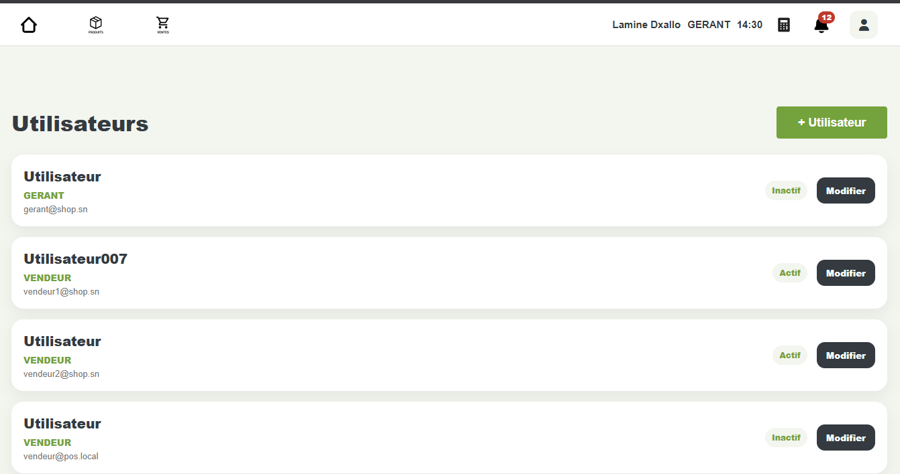

# POS MVP

Application de gestion commerciale développée dans le cadre du titre professionnel **Concepteur Développeur d’Applications (CDA)**.

## Contexte


POS MVP est né d'une observation personnelle du commerce en Afrique de l'Ouest.

Ayant grandi dans une famille de commerçants, j'ai été confronté très tôt aux réalités du terrain : gestion sur cahier, suivi manuel des ventes, inventaires approximatifs et difficulté à obtenir une vision fiable de l'activité quotidienne.

Ces contraintes deviennent encore plus importantes lorsqu'un commerce est géré par plusieurs personnes ou lorsque les investisseurs, associés ou membres de la famille se trouvent dans une autre ville ou un autre pays.

Un constat revenait régulièrement :

* les ventes sont enregistrées sur papier ;
* les stocks sont difficiles à suivre ;
* les informations circulent par téléphone ou WhatsApp ;
* les chiffres réels sont souvent connus avec retard ;
* la confiance entre associés repose davantage sur la communication que sur des données fiables.

Cette problématique est particulièrement visible dans de nombreux commerces d'Afrique de l'Ouest où la transformation numérique reste limitée alors même que les smartphones et l'accès à Internet se démocratisent rapidement.

POS MVP a été imaginé comme une première réponse à ce besoin.

L'objectif n'est pas seulement de remplacer un cahier de caisse, mais de créer les fondations d'une plateforme de supervision commerciale permettant à un commerçant, un gérant ou un investisseur de suivre l'activité d'un point de vente en temps réel.

Cette première version se concentre sur les besoins essentiels :

* gestion des produits ;
* gestion du stock ;
* suivi des ventes ;
* gestion des utilisateurs ;
* tableau de bord d'activité.

À plus long terme, cette vision pourra évoluer vers une plateforme SaaS de supervision commerciale adaptée aux réalités du marché ouest-africain.
ette ou ordinateur, permettant de suivre l’activité commerciale en temps réel.

---

## Fonctionnalités

### Authentification

* connexion par code PIN ;
* gestion des rôles ;
* session utilisateur.

### Produits

* création et modification de produits ;
* activation / désactivation ;
* gestion des catégories ;
* historique des prix.

### Stock

* suivi des quantités ;
* alertes de stock faible ;
* détection des ruptures.

### Ventes

* création rapide d’une vente ;
* calcul automatique des montants ;
* historique des ventes ;
* détail des transactions.

### Utilisateurs

* création et modification ;
* gestion des rôles ;
* activation / désactivation.

### Dashboard

* chiffre d’affaires ;
* ventes réalisées ;
* articles vendus ;
* panier moyen ;
* produits les plus vendus ;
* ventes récentes ;
* alertes stock.

---

## Stack technique

### Backend

* Java 21
* Spring Boot
* Spring MVC
* Spring Data JPA
* Hibernate

### Base de données

* MySQL

### Frontend

* Thymeleaf
* HTML5
* SCSS
* JavaScript

### Outils

* Maven
* Git
* GitHub

---

## Architecture

Architecture modulaire organisée par domaine métier :

```txt
category/
product/
sale/
stock/
user/
dashboard/
shared/
```

Chaque module contient :

```txt
controller
service
repository
entity
dto
```

---

## Modèle métier

Principales entités :

* User
* Category
* Product
* ProductPrice
* Sale
* SaleItem

---

## Captures
## Dashboard

Suivi de l'activité commerciale en temps réel.
Le tableau de bord centralise les principaux indicateurs de performance : chiffre d'affaires, ventes réalisées, produits vendus, panier moyen ainsi que les alertes de stock. Il permet au gérant de suivre l'activité commerciale en temps réel.


## Gestion des ventes

L'interface de vente a été pensée pour une utilisation rapide sur tablette ou ordinateur. Elle permet d'ajouter des produits au panier, de calculer automatiquement le montant total et d'enregistrer les transactions.

## Catalogue produits

Les produits sont organisés par catégories avec recherche, filtres et informations de stock. Cette vue facilite la gestion quotidienne du catalogue.

Fiche produit

Chaque produit dispose d'une fiche détaillée comprenant son historique de prix, ses informations principales et les opérations de gestion associées.

## Gestion des utilisateurs

L'application permet de gérer les utilisateurs, leurs rôles et leurs accès afin de sécuriser l'utilisation du système.

---

## Roadmap

### MVP (terminé)

* gestion produits
* gestion stock
* ventes
* dashboard
* utilisateurs

### V1

* API REST
* Frontend React
* Authentification JWT
* Gestion fournisseurs
* Gestion clients

### V2

* Multi-boutiques
* SaaS
* Supervision distante
* Reporting avancé

---

## Auteur

Mamadou Lamine Diallo

Projet CDA 2026.
