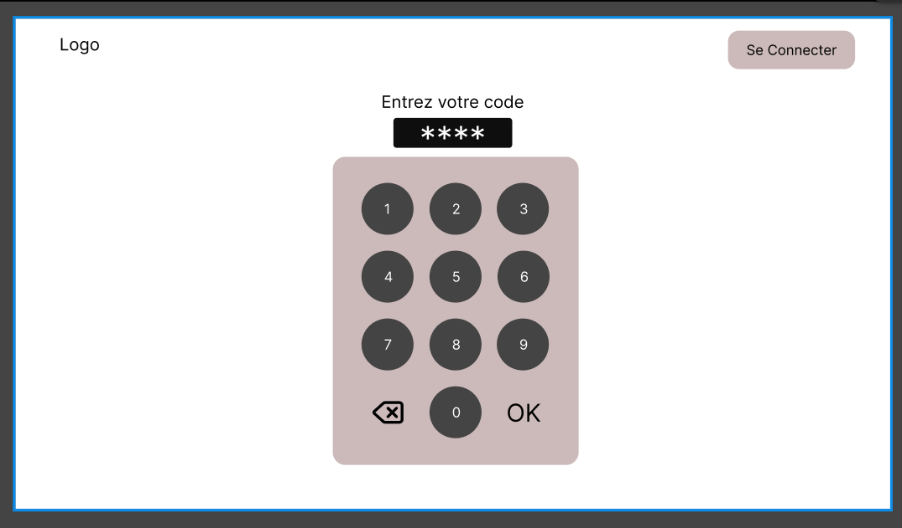
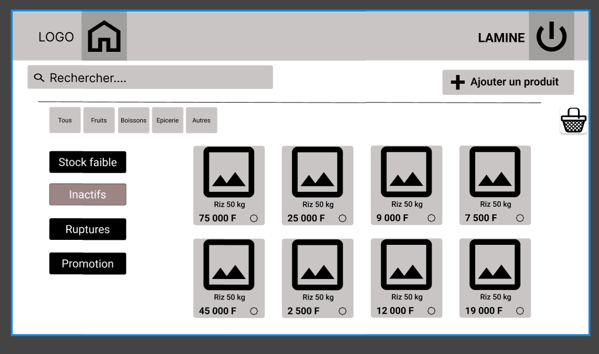
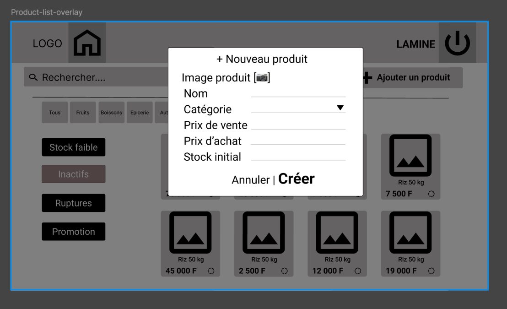
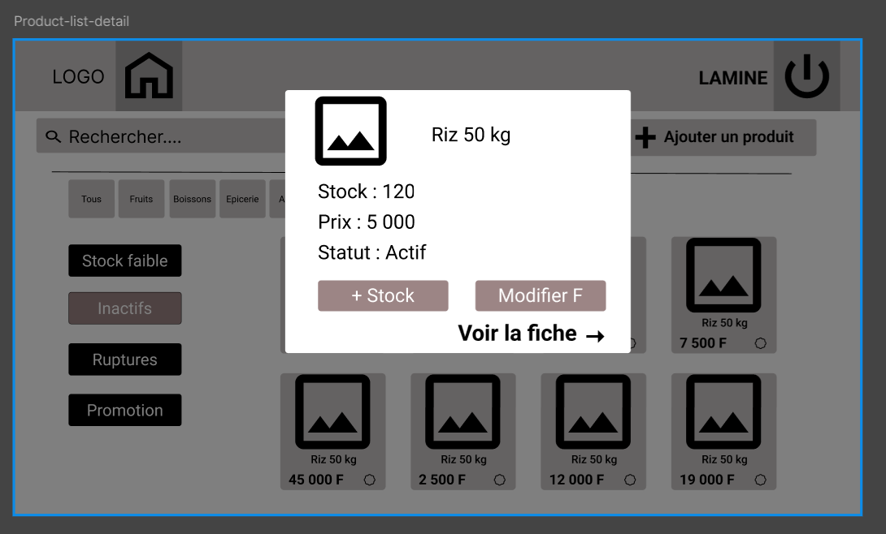
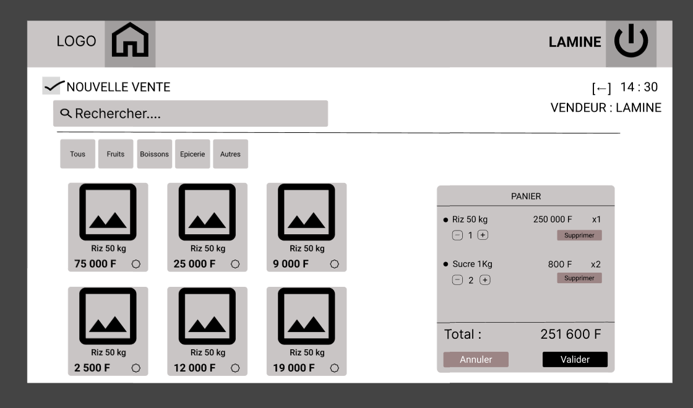
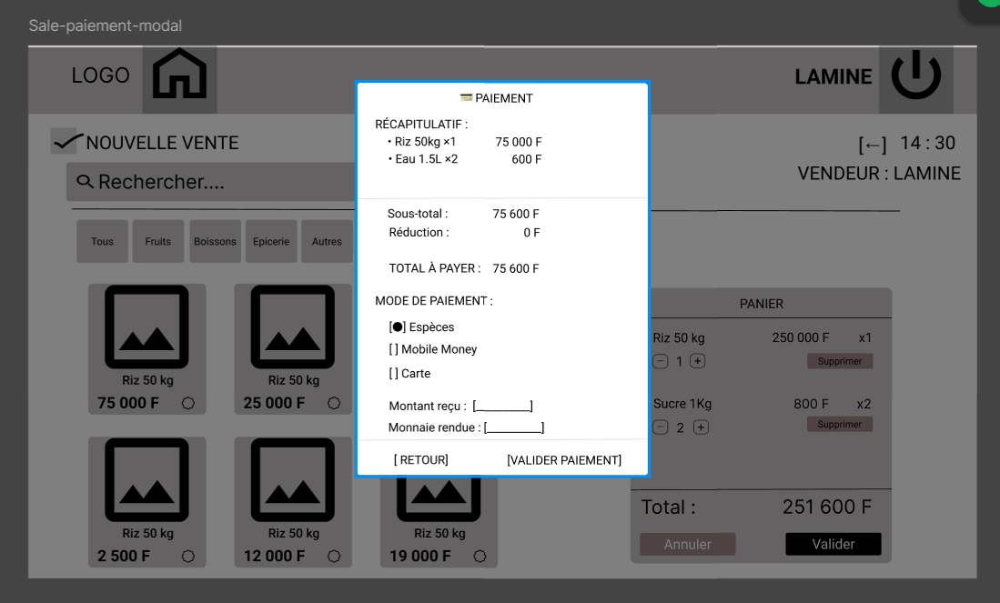
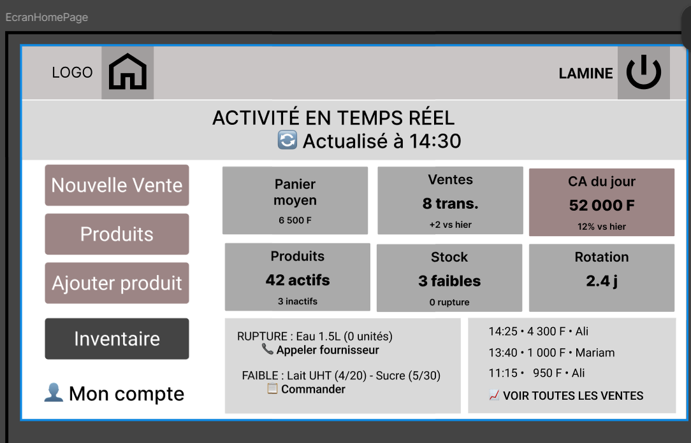

# 5. Maquettage et expérience utilisateur

## 5.1 Objectifs du maquettage

Avant le développement du MVP, une phase de réflexion sur l’interface utilisateur a été réalisée afin de définir les principaux parcours de navigation et l’organisation générale de l’application.

L’objectif du maquettage était de concevoir une interface simple, rapide et adaptée aux contraintes d’utilisation d’un commerce de proximité.

Les utilisateurs visés n’étant pas nécessairement des profils techniques, une attention particulière a été portée à la lisibilité des écrans et à la simplicité des actions les plus fréquentes.

Les maquettes ont servi à structurer les parcours envisagés avant le développement et à identifier les principaux écrans nécessaires au fonctionnement du produit. Aucune validation formelle par un panel d’utilisateurs n’est documentée à ce stade.

Les écrans ont été conçus avec **Figma**, sous forme de maquettes fonctionnelles représentant les interactions essentielles : connexion par PIN, consultation du catalogue, ajout et détail produit, création de vente, paiement et accueil.

## 5.2 Principes de conception UX

Plusieurs principes ont guidé la conception de l’interface. Les maquettes Figma ont permis de matérialiser ces principes avant leur traduction en HTML, CSS et JavaScript.

### Simplicité

Les actions principales doivent être accessibles rapidement sans nécessiter de navigation complexe.

L’utilisateur doit pouvoir réaliser une vente ou consulter une information importante en quelques interactions seulement.

### Rapidité d’exécution

L’application est destinée à être utilisée dans un contexte opérationnel.

Les parcours ont donc été optimisés afin de limiter le nombre de clics nécessaires pour réaliser les actions courantes.

### Cohérence

Les écrans partagent une structure visuelle commune afin de faciliter l’apprentissage de l’application.

Les composants récurrents tels que les formulaires, boutons, cartes produits et filtres utilisent les mêmes conventions visuelles.

### Adaptation aux écrans tactiles

Le projet étant destiné à une utilisation sur ordinateur portable ou tablette, les éléments interactifs ont été conçus avec des dimensions adaptées à un usage tactile.

## 5.3 Parcours utilisateurs principaux

L’analyse des besoins a permis d’identifier plusieurs parcours utilisateurs majeurs.

### Authentification

Le parcours commence par l’écran de connexion.

L’utilisateur saisit son code PIN afin d’accéder aux fonctionnalités correspondant à son rôle. La maquette prévoit un pavé numérique et une saisie masquée, adaptés à un usage tactile.



*Figure 5.1 — Maquette Figma de l’écran de connexion par PIN.*

**Enchaînement des écrans prévu dans les maquettes :**

```text
Connexion par PIN
       ↓
Accueil / indicateurs
       ├──→ Catalogue produits ──→ Ajout de produit
       │                       └──→ Détail produit / actions stock
       └──→ Nouvelle vente ──→ Panier ──→ Paiement
```

Ce schéma synthétise la navigation envisagée à partir des maquettes ; il ne constitue pas une preuve de toutes les règles d’autorisation implémentées.

### Gestion des produits

Le gérant peut :

- consulter la liste des produits ;
- rechercher un produit ;
- filtrer les produits ;
- créer un produit ;
- modifier un produit ;
- consulter les détails d’un produit.



*Figure 5.2 — Catalogue : recherche, filtres et cartes produits.*



*Figure 5.3 — Fenêtre modale de création : catégorie, prix et stock initial.*



*Figure 5.4 — Détail produit : stock, prix, statut et actions prévues.*

### Réalisation d’une vente

Le vendeur sélectionne les produits depuis le catalogue.

Les articles sont ajoutés au panier puis la vente est validée après vérification du montant total.

Une fois la vente enregistrée, le stock est automatiquement mis à jour dans le fonctionnement attendu du MVP.



*Figure 5.5 — Écran de vente : catalogue et panier latéral visibles simultanément.*



*Figure 5.6 — Fenêtre de paiement prévue : récapitulatif, mode de règlement et montant reçu.*

### Consultation du tableau de bord

Le gérant ou le propriétaire consulte les indicateurs principaux :

- chiffre d’affaires ;
- ventes réalisées ;
- produits les plus vendus ;
- ventes récentes ;
- alertes de stock.



*Figure 5.7 — Maquette de l’accueil : indicateurs commerciaux, alertes et accès aux actions principales.*

## 5.4 Évolution des maquettes

Au cours du développement, plusieurs ajustements ont été réalisés afin d’améliorer l’expérience utilisateur.

Parmi les principales évolutions :

- ajout d’un système de navigation adapté au mobile et au desktop ;
- amélioration de la disposition des cartes produits ;
- intégration de filtres de recherche ;
- création d’overlays pour les formulaires ;
- ajout de notifications visuelles ;
- amélioration de l’affichage des informations du tableau de bord.

Cette approche itérative a permis de faire évoluer l’interface en fonction des besoins identifiés pendant le développement.

**Exemples observables de cette évolution :** la maquette du catalogue prévoit une grille de cartes et des filtres ; l’écran MVP réalisé reprend ces éléments avec une présentation et des états de stock affinés. La maquette de vente prévoit un panier latéral ; l’interface MVP conserve ce principe. Enfin, la maquette d’accueil organise les indicateurs sous forme de blocs, tandis que le tableau de bord réalisé ajoute notamment une courbe d’évolution des ventes.

Les captures du MVP effectivement développé et testé sont présentées au **chapitre 9**. Cette comparaison distingue les intentions de conception des fonctionnalités visibles dans l’application finale.

## 5.5 Résultat obtenu

Les maquettes Figma documentent les choix de conception qui ont guidé la réalisation d’une interface :

- simple à prendre en main ;
- cohérente ;
- adaptée à un usage quotidien ;
- compatible avec les besoins du MVP.

Les écrans réalisés constituent une base solide pour les futures évolutions du produit, notamment la migration vers une architecture React dans les versions ultérieures.