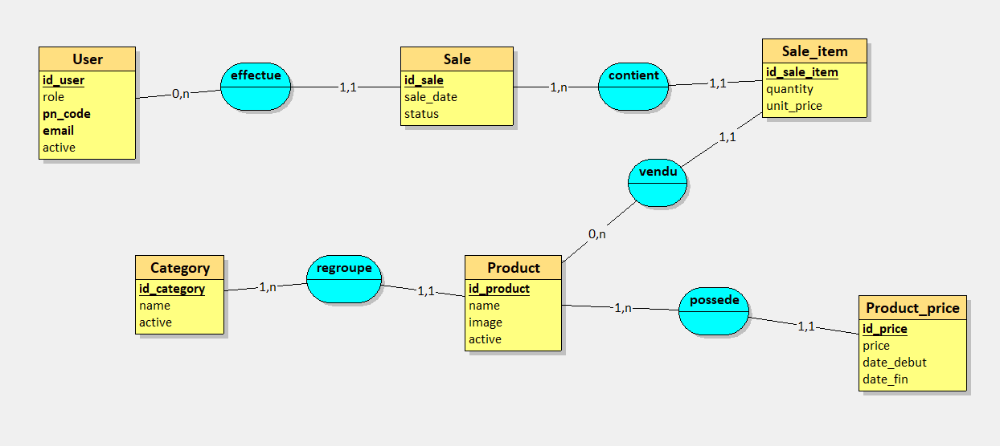
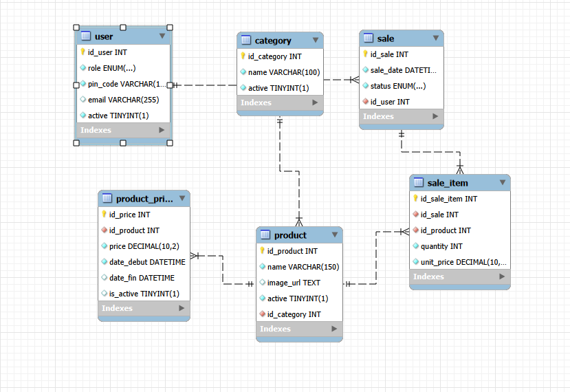
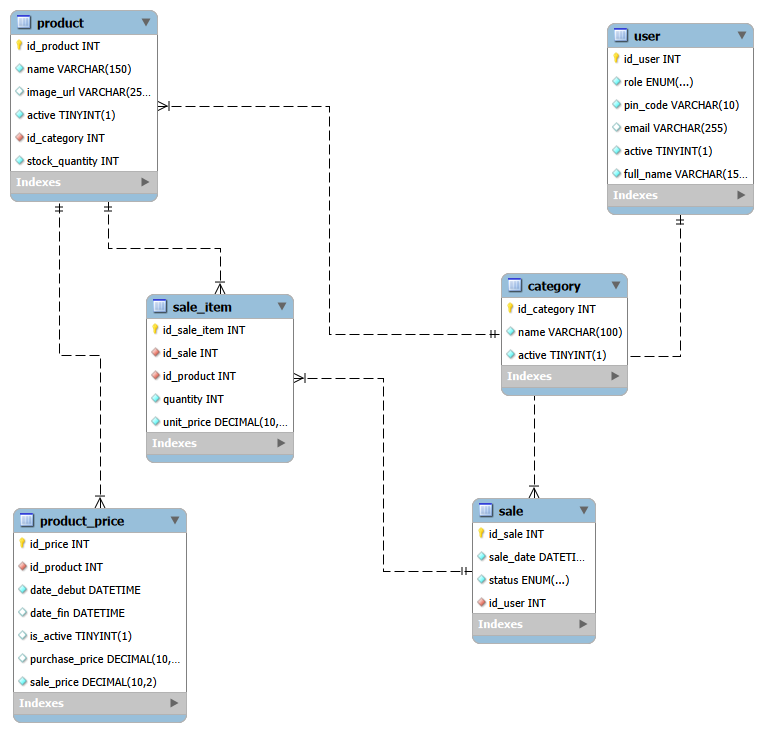

# 6. Modélisation des données

## 6.1 Règles de gestion

Avant la conception de la base de données, plusieurs règles de gestion ont été identifiées à partir des besoins métier du projet.

Ces règles permettent de garantir la cohérence des données et de structurer le modèle de manière conforme au fonctionnement réel d’un commerce.

Les principales règles retenues sont les suivantes :

* Un utilisateur se connecte à l’application grâce à un code PIN unique.
* Un utilisateur possède un rôle permettant de définir ses droits d’accès.
* Un utilisateur peut être actif ou inactif.
* Une catégorie peut contenir plusieurs produits.
* Un produit appartient obligatoirement à une seule catégorie.
* Un produit peut être actif ou inactif.
* Un produit possède une quantité disponible en stock.
* Un produit peut apparaître dans plusieurs ventes.
* Un produit peut avoir plusieurs prix dans le temps.
* Un seul prix peut être actif pour un produit à un instant donné.
* Une vente est réalisée par un utilisateur.
* Une vente contient une ou plusieurs lignes de vente.
* Chaque ligne de vente concerne un seul produit.
* Chaque ligne de vente conserve le prix unitaire appliqué lors de la transaction.
* La validation d’une vente entraîne la décrémentation du stock.
* Les indicateurs du tableau de bord sont calculés uniquement à partir des ventes validées.

Ces règles constituent le socle fonctionnel de la modélisation des données.

---

## 6.2 Dictionnaire de données

Le dictionnaire de données permet de recenser les principales informations manipulées par l’application.

### AppUser

| Attribut | Description                  |
| -------- | ---------------------------- |
| id       | Identifiant unique           |
| fullName | Nom complet de l'utilisateur |
| email    | Adresse électronique         |
| pinCode  | Code PIN de connexion        |
| role     | Rôle métier                  |
| active   | État du compte               |

### Category

| Attribut | Description          |
| -------- | -------------------- |
| id       | Identifiant unique   |
| name     | Nom de la catégorie  |
| active   | État de la catégorie |

### Product

| Attribut      | Description         |
| ------------- | ------------------- |
| id            | Identifiant unique  |
| name          | Nom du produit      |
| imageUrl      | Image du produit    |
| stockQuantity | Quantité disponible |
| active        | État du produit     |

### ProductPrice

| Attribut      | Description               |
| ------------- | ------------------------- |
| id            | Identifiant unique        |
| purchasePrice | Prix d'achat              |
| salePrice     | Prix de vente             |
| startDate     | Date de début de validité |
| endDate       | Date de fin de validité   |

### Sale

| Attribut | Description        |
| -------- | ------------------ |
| id       | Identifiant unique |
| saleDate | Date de la vente   |
| status   | Statut de la vente |

### SaleItem

| Attribut  | Description            |
| --------- | ---------------------- |
| id        | Identifiant unique     |
| quantity  | Quantité vendue        |
| unitPrice | Prix unitaire appliqué |

---

## 6.3 Modèle Conceptuel de Données (MCD)

Le Modèle Conceptuel de Données représente les informations métier indépendamment de toute considération technique.

Les entités principales identifiées sont :

* AppUser
* Category
* Product
* ProductPrice
* Sale
* SaleItem

Les relations métier sont les suivantes :

### Utilisateur et vente

Un utilisateur peut réaliser plusieurs ventes.

Une vente est obligatoirement réalisée par un seul utilisateur.

```text
AppUser 1 ─── * Sale
```

### Catégorie et produit

Une catégorie peut contenir plusieurs produits.

Un produit appartient obligatoirement à une catégorie.

```text
Category 1 ─── * Product
```

### Produit et historique de prix

Un produit peut posséder plusieurs prix dans le temps.

Chaque prix est associé à un seul produit.

```text
Product 1 ─── * ProductPrice
```

### Vente et lignes de vente

Une vente contient une ou plusieurs lignes.

Chaque ligne appartient à une seule vente.

```text
Sale 1 ─── * SaleItem
```

### Produit et lignes de vente

Un produit peut apparaître dans plusieurs lignes de vente.

Chaque ligne concerne un seul produit.

```text
Product 1 ─── * SaleItem
```

Le MCD permet de représenter fidèlement les règles métier identifiées lors de l’analyse des besoins.



**Figure 6.1 — MCD initial du MVP.** Réalisé pendant la phase de conception, ce schéma présente les six entités métier et leurs associations. Les cardinalités constituent des hypothèses initiales de conception : certaines participations minimales (par exemple une catégorie possédant au moins un produit) ne doivent pas être confondues avec des contraintes automatiquement imposées par la base finale.

Le schéma utilise les noms `User` et `Sale_item`, alors que le code Java emploie notamment `AppUser` et `SaleItem`. Il s'agit de deux niveaux de représentation du même domaine métier.

---

## 6.4 Modèle Logique de Données (MLD)

Le MLD constitue la traduction relationnelle du MCD.

Les principales tables obtenues sont :

```text
APP_USER
(
    id,
    full_name,
    email,
    pin_code,
    role,
    active
)

CATEGORY
(
    id,
    name,
    active
)

PRODUCT
(
    id,
    name,
    image_url,
    stock_quantity,
    active,
    category_id
)

PRODUCT_PRICE
(
    id,
    product_id,
    purchase_price,
    sale_price,
    start_date,
    end_date
)

SALE
(
    id,
    sale_date,
    status,
    user_id
)

SALE_ITEM
(
    id,
    sale_id,
    product_id,
    quantity,
    unit_price
)
```

Les clés étrangères permettent de matérialiser les relations identifiées dans le modèle conceptuel.

**Lecture relationnelle du MLD — identifiants et dépendances :**

| Relation | Clé primaire (PK) | Clés étrangères (FK) |
|---|---|---|
| `APP_USER` (nom logique) | `id` | — |
| `CATEGORY` | `id` | — |
| `PRODUCT` | `id` | `category_id` → `CATEGORY.id` |
| `PRODUCT_PRICE` | `id` | `product_id` → `PRODUCT.id` |
| `SALE` | `id` | `user_id` → `APP_USER.id` |
| `SALE_ITEM` | `id` | `sale_id` → `SALE.id` ; `product_id` → `PRODUCT.id` |

Les identifiants du MLD sont ici **logiques**. Dans le MPD réellement généré depuis MySQL, ils sont nommés `id_user`, `id_product`, `id_category`, `id_sale`, `id_sale_item` et `id_price`. La table logique `APP_USER` correspond à la table physique `user`.

Le MLD présente les relations indépendamment des détails SQL ; les noms des colonnes et les contraintes exactes sont à vérifier dans le MPD et les scripts de création de la base.

---

## 6.5 Modèle Physique de Données (MPD)

Le MPD correspond à l’implémentation effective du modèle dans MySQL.

### Évolution du modèle physique



**Figure 6.2 — MPD initial.** Première traduction du modèle métier en tables SQL. Ce schéma historique ne représente pas toutes les colonnes finalement ajoutées pendant la réalisation.



**Figure 6.3 — MPD final du MVP.** Diagramme EER obtenu par rétro-ingénierie du schéma `project_pos` avec MySQL Workbench. Il montre les six tables physiques, les types de colonnes visibles et les relations définies par clés étrangères.

Les principales évolutions constatées entre ces deux états sont :

| Élément | Conception initiale | Implémentation finale observée |
|---|---|---|
| Produit | Identification, libellé, image, statut | Ajout de `stock_quantity` pour le stock disponible |
| Utilisateur | Rôle, PIN, email, statut | Ajout de `full_name` |
| Prix | Montant `price` | Distinction `sale_price` / `purchase_price` |
| Période de validité | Dates de début et de fin | `date_debut`, `date_fin` et indicateur `is_active` |
| Ligne de vente | Quantité et prix de la transaction | Maintien de `unit_price` dans `sale_item` |

Cette évolution n'a pas modifié les six domaines de données fondamentaux ; elle a précisé les attributs nécessaires à l'exploitation métier. Le MPD final est la référence pour les **noms physiques** des colonnes, qui diffèrent parfois du dictionnaire Java et du MLD logique.


Les principales décisions techniques retenues sont :

* utilisation de clés primaires auto-incrémentées ;
* utilisation de clés étrangères pour garantir l’intégrité référentielle ;
* utilisation de DECIMAL pour les montants financiers ;
* utilisation de DATETIME pour les dates métier ;
* utilisation de contraintes d’unicité sur les données sensibles ;
* utilisation d’index sur les colonnes fréquemment sollicitées.

Exemples :

* PIN utilisateur unique ;
* index sur les dates de vente ;
* index sur les relations entre produits et catégories ;
* index sur les prix actifs.

Cette structure vise à assurer la cohérence des données tout en facilitant leur interrogation.

**Portée des preuves :** le diagramme Workbench permet de constater les tables, les colonnes et les relations affichées. Il ne suffit pas, à lui seul, à prouver toutes les règles d'unicité, les index secondaires, les contrôles de quantité ou le respect d'un seul prix actif. Ces points doivent être rapprochés des contraintes SQL et de la logique applicative. En particulier, `is_active` et `date_fin` décrivent l'état d'un prix, mais leur seule présence ne garantit pas l'unicité du prix actif.

---

## 6.6 Justification des choix de modélisation

La conception du modèle de données a été guidée par des considérations métier avant les considérations techniques.

L’une des décisions les plus importantes concerne la séparation entre Product et ProductPrice.

Plutôt que de stocker directement le prix dans la table produit, une entité dédiée a été créée afin de conserver l’historique des évolutions tarifaires.

Cette approche permet de connaître les anciens prix, d’assurer la traçabilité des modifications et de préparer la mise en place future d’analyses statistiques plus avancées.

Une autre décision importante concerne l’entité SaleItem.

Le prix unitaire est conservé directement dans chaque ligne de vente afin de préserver l’historique réel des transactions. Ainsi, une modification ultérieure du prix d’un produit n’altère jamais les ventes déjà enregistrées.

Enfin, le choix d’une base de données relationnelle a été retenu pour le MVP afin de bénéficier des garanties ACID, de l’intégrité référentielle et de la cohérence des données nécessaires à une application manipulant des transactions commerciales.

Cette modélisation constitue une base structurée pour le MVP et ses évolutions. La comparaison entre les schémas initiaux et le MPD extrait de la base illustre le passage des besoins métier à une implémentation concrète.

Dans la V2, la séparation des bases MySQL par service et l'introduction de MongoDB sont présentées au chapitre 14. Le présent chapitre reste volontairement centré sur la **modélisation du MVP monolithique**.

## 6.7 La sécurité des données : parce que l'argent, ça compte

PROJECT_POS est une application de gestion commerciale. Elle manipule des informations directement liées à l'activité économique d'un commerce : ventes, prix d'achat, prix de vente, quantités en stock et historique des transactions.

Une erreur, une modification non autorisée ou une perte de données peut donc avoir des conséquences financières.

Dès la conception du MVP, la sécurité de la base de données a été prise en compte à travers la séparation des accès, les mécanismes de persistance et les contraintes d'intégrité.

### 6.7.1 Un utilisateur dédié, pas de root

Une première règle consiste à ne pas utiliser le compte administrateur `root` pour les connexions courantes de l'application.

Pour PROJECT_POS, un utilisateur MySQL spécifique, nommé `lamine`, a été créé afin de permettre à Spring Boot d'accéder à la base `project_pos`.

La configuration `application.properties` utilise effectivement ce compte.

Cette séparation permet de ne pas exposer les identifiants administrateur du serveur MySQL à l'application.

Elle constitue une première application du **principe du moindre privilège**, même si les permissions accordées doivent encore être affinées.

**Preuve technique :**

La commande suivante a été exécutée dans MySQL Workbench :

```sql
SHOW GRANTS FOR 'lamine'@'localhost';
```

Elle confirme l'existence du compte et l'attribution de privilèges sur le schéma `project_pos`.

### 6.7.2 Des permissions adaptées aux besoins

Le principe du moindre privilège consiste à n'accorder à un utilisateur que les autorisations nécessaires à ses opérations.

Dans la configuration actuelle du MVP, le compte `lamine` dispose de `ALL PRIVILEGES` sur la base `project_pos`, sans privilèges globaux accordés par les lignes vérifiées.

Cette configuration est fonctionnelle pour le développement, mais elle reste plus permissive que nécessaire pour une exploitation en production.

Une configuration plus restrictive pourrait être définie ainsi :

```sql
GRANT SELECT, INSERT, UPDATE, DELETE
ON project_pos.*
TO 'lamine'@'localhost';
```

Cet exemple illustre les permissions courantes nécessaires à l'exploitation de l'application. Il ne représente pas la configuration actuellement appliquée.

Les opérations de création ou de modification des tables (`CREATE`, `ALTER`, `DROP`) devraient être réservées à un compte d'administration ou à un processus de migration.

Cette évolution permettrait de limiter les conséquences d'une compromission du compte applicatif.

### 6.7.3 Protéger les données contre les injections SQL

Une injection SQL consiste à détourner une requête en introduisant des instructions malveillantes dans une donnée fournie à l'application.

Pour limiter ce risque, PROJECT_POS utilise **Spring Data JPA et Hibernate** pour accéder à MySQL.

Les opérations standards des repositories reposent sur des mécanismes de requêtes paramétrées, qui séparent les valeurs transmises par l'utilisateur de la structure des requêtes SQL.

Par exemple, un repository Spring Data JPA peut définir une recherche de cette manière :

```java
List<Product> findByCategoryId(Integer categoryId);
```

Cet extrait illustre le principe d'une méthode de requête dérivée ; il ne constitue pas une reproduction vérifiée du code source du MVP.

L'utilisation de JPA ne supprime pas automatiquement tous les risques. Les requêtes natives ou construites dynamiquement doivent également respecter la séparation entre les paramètres et les instructions SQL.

La validation des entrées utilisateur complète cette protection, sans remplacer les requêtes paramétrées.

### 6.7.4 Protéger les informations d'authentification

L'application utilise un système de connexion par code PIN pour identifier les utilisateurs.

Le modèle de données prévoit notamment les champs `pin_code`, `role` et `active`.

Ces informations doivent faire l'objet d'une protection particulière, car elles participent au contrôle des accès à l'application.

Le hachage des codes PIN avec un algorithme adapté, tel que BCrypt, constitue une mesure de sécurité à prévoir ou à vérifier avant une exploitation en production.

### 6.7.5 Les index : trouver rapidement les informations

La performance des accès aux données constitue également un enjeu pour un logiciel de caisse.

À mesure que les ventes et les produits s'accumulent, certaines recherches peuvent devenir plus coûteuses.

Les index permettent à MySQL d'accélérer l'accès aux enregistrements, notamment lors des recherches par identifiant, des jointures et des filtrages.

Les colonnes suivantes constituent des candidates pertinentes :

- `product.id_category`, pour retrouver les produits d'une catégorie ;
- `sale.sale_date`, pour consulter les ventes d'une période ;
- `product_price.id_product`, pour retrouver l'historique tarifaire d'un produit.

Cette optimisation complète les choix de modélisation visant à assurer la cohérence et les performances de l'application.

### 6.7.6 Bilan : sécurité, intégrité et performance

La modélisation de PROJECT_POS repose sur plusieurs mécanismes complémentaires :

- Un compte MySQL dédié, distinct de `root`.
- Une séparation des accès au niveau du schéma de données.
- L'utilisation de Spring Data JPA et Hibernate pour les opérations de persistance.
- Des clés primaires et étrangères pour préserver la cohérence relationnelle.
- La conservation du prix unitaire dans chaque ligne de vente pour garantir l'historique commercial.
- Une réflexion sur les privilèges, la protection des codes PIN et l'optimisation des accès.

Ces choix constituent une base technique pour la sécurisation du MVP.


