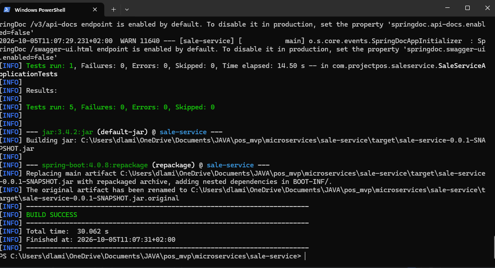
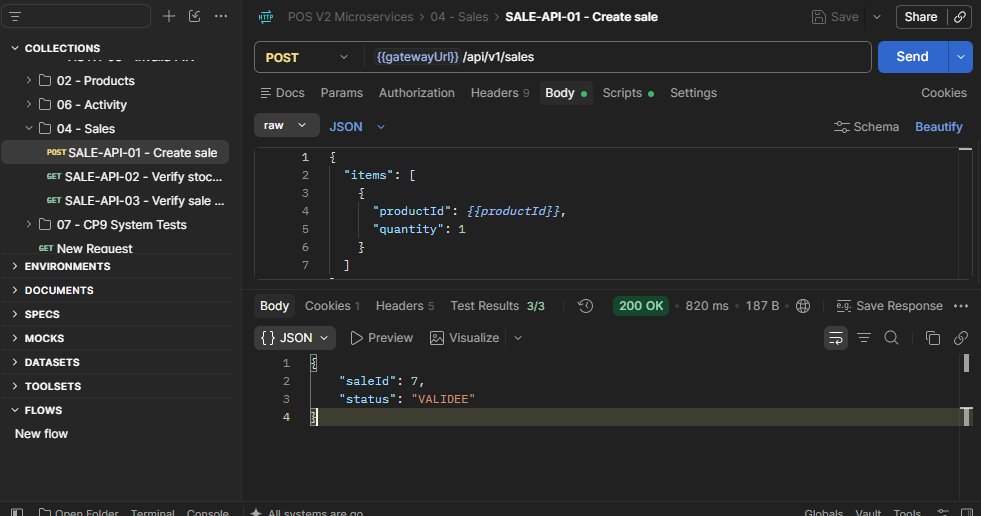
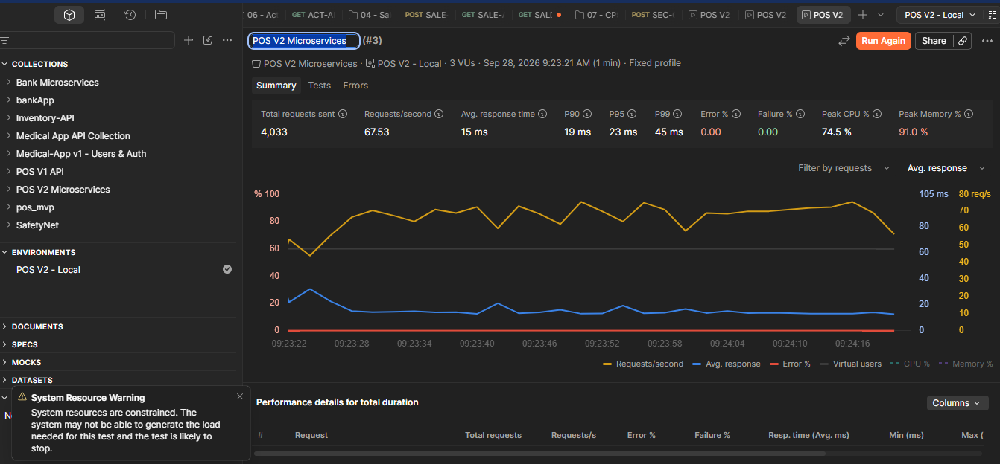

# 9. Tests et validation du projet

## 9.1 Objectifs des tests

La phase de tests a pour objectif de vérifier le bon fonctionnement des fonctionnalités développées et de s’assurer que l’application répond correctement aux besoins identifiés lors de l’analyse.

Les tests réalisés visent à :

- valider les règles métier ;
- détecter les anomalies ;
- vérifier la cohérence des données ;
- garantir la stabilité de l’application ;
- sécuriser les évolutions futures.

Les scénarios de tests ont été construits à partir des principaux cas d’usage de l’application.

La stratégie de validation a évolué avec le projet. Le MVP a d’abord fait l’objet de validations fonctionnelles centrées sur les règles métier. Lors du passage à l’API REST puis à l’architecture microservices V2, ces validations ont été complétées par des tests automatisés, des tests d’intégration avec Postman, des tests de sécurité fonctionnelle et des tests de performance.

Le plan de tests détaillé de la V2 est conservé dans :

`docs/tests/plan-tests-v2.md`

---

## 9.2 Validation de l’authentification

Les tests réalisés sur le module d’authentification ont permis de vérifier :

- la connexion avec un PIN valide ;
- le refus de connexion avec un PIN invalide ;
- la création correcte de la session utilisateur ;
- l’affichage de l’utilisateur connecté ;
- la déconnexion.

**Résultat :**

L’ensemble des scénarios testés a été validé.

Dans la V2, l’authentification a également été vérifiée à travers l’API Gateway. Une connexion avec un PIN valide retourne une réponse HTTP 200 et crée la session utilisée pour les appels authentifiés suivants. Une tentative avec un PIN invalide est refusée.

---

## 9.3 Validation de la gestion des utilisateurs

Les tests réalisés concernent :

- la création d’un utilisateur ;
- la modification d’un utilisateur ;
- l’activation ;
- la désactivation ;
- le contrôle de l’unicité du code PIN.

**Résultat :**

Les règles métier définies pour la gestion des utilisateurs sont respectées.

Les contraintes d’intégrité empêchent la création de codes PIN dupliqués.

---

## 9.4 Validation de la gestion des catégories

Les scénarios testés concernent :

- la création d’une catégorie ;
- la modification d’une catégorie ;
- l’activation ;
- la désactivation ;
- l’affichage des catégories dans les différents modules.

**Résultat :**

Les catégories sont correctement propagées dans les écrans produits et ventes.

---

## 9.5 Validation de la gestion des produits

Les tests réalisés ont permis de vérifier :

- la création d’un produit ;
- la modification d’un produit ;
- la gestion du stock ;
- les catégories ;
- l’activation ;
- la désactivation ;
- l’affichage des détails.

Une attention particulière a été portée à la cohérence des quantités disponibles et à leur évolution lors des opérations de stock et de vente.

**Résultat :**

Les fonctionnalités de gestion produit sont opérationnelles et cohérentes avec les règles métier définies.

---

## 9.6 Validation de l’historique des prix

Le module `ProductPrice` a fait l’objet de tests spécifiques.

Les vérifications ont porté sur :

- la création d’un nouveau prix ;
- la clôture automatique de l’ancien prix ;
- la conservation de l’historique ;
- la récupération du prix actif.

**Résultat :**

Un seul prix actif est présent pour un produit à un instant donné.

L’historique des modifications est correctement conservé.

Durant le développement, un cas d’erreur a notamment mis en évidence une violation de la contrainte d’unicité lors du remplacement du prix actif. La correction consiste à clôturer et enregistrer l’ancien prix puis à forcer la synchronisation avec la base avant l’insertion du nouveau prix.

Ce comportement fait désormais partie des scénarios couverts par les tests du `product-service`.

---

## 9.7 Validation du processus de vente

Le processus de vente constitue le scénario métier principal du projet.

Les tests réalisés concernent :

- l’ajout de produits à une vente ;
- la gestion des quantités ;
- la récupération du prix actif ;
- la validation d’une vente ;
- la création des lignes de vente ;
- la conservation du prix unitaire au moment de la transaction ;
- la décrémentation du stock.

**Résultat :**

Les ventes sont correctement enregistrées et les données nécessaires à l’historique de la transaction sont conservées.

Dans la V2, le prix unitaire est figé dans `SaleItem`. Une modification ultérieure du prix du produit ne modifie donc pas les ventes déjà enregistrées.

---

## 9.8 Validation de la gestion du stock

Les tests réalisés concernent :

- l’ajout manuel de stock ;
- la décrémentation automatique après vente ;
- le contrôle de la quantité disponible.

**Résultat :**

Les quantités disponibles sont correctement mises à jour après les opérations testées.

Ce comportement a également été vérifié dans l’architecture microservices : `sale-service` demande la décrémentation du stock à `product-service` au cours du traitement d’une vente.

---

## 9.9 Validation du tableau de bord

Les indicateurs du tableau de bord du MVP ont été comparés aux données enregistrées dans la base.

Les tests concernent :

- le chiffre d’affaires ;
- le nombre de ventes ;
- les articles vendus ;
- le panier moyen ;
- les produits les plus vendus ;
- les ventes récentes ;
- les alertes de stock.

Les filtres de période ont également été vérifiés.

**Résultat :**

Les indicateurs affichés correspondent aux données présentes dans la base de données.

---

## 9.10 Difficultés rencontrées pendant les validations

Plusieurs difficultés ont été rencontrées durant le développement et les différentes campagnes de tests.

Parmi les principales :

- la gestion de l’historique des prix ;
- la cohérence des agrégations du tableau de bord ;
- la gestion du stock après validation d’une vente ;
- l’organisation et la séparation des traitements métier ;
- la stabilisation de l’interface utilisateur ;
- la communication entre services dans la V2 ;
- l’isolation des dépendances externes lors des tests automatisés.

Ces difficultés ont été progressivement résolues grâce à une approche itérative : développement, test, correction puis nouvelle validation.

---

## 9.11 Campagne de tests automatisés de la V2

Le passage à une architecture microservices a nécessité de compléter les validations fonctionnelles du MVP par des tests automatisés propres aux différents services.

La campagne ciblée couvre notamment :

- `user-service` : authentification, création et modification des utilisateurs et contrôle du PIN ;
- `product-service` : règles métier produit, stock et gestion de l’historique des prix ;
- `sale-service` : création des ventes et interactions avec les services distants ;
- `activity-service` : création, validation et filtrage des événements d’activité.

Au total, **22 tests automatisés ciblés** ont été exécutés sur ces composants, auxquels s’ajoutent les tests de chargement du contexte Spring présents dans les différents projets.

Pour les services SQL, un profil de test utilisant H2 permet d’isoler les tests automatisés de l’infrastructure MySQL locale. Les dépendances Config Server et Consul sont également désactivées lorsque leur présence n’est pas nécessaire au scénario testé.

Cette stratégie rend les tests reproductibles, y compris dans l’environnement d’intégration continue.

La figure suivante présente un exemple d’exécution sur `sale-service`.



**Figure — Exécution automatisée des tests de `sale-service` avec Maven. Les cinq tests sont exécutés sans échec ni erreur et le build se termine avec succès.**

---

## 9.12 Tests d’intégration avec Postman

Les tests d’intégration de la V2 ont été réalisés avec Postman en utilisant l’API Gateway comme point d’entrée.

Ils permettent de tester l’application dans des conditions proches de son utilisation réelle, avec plusieurs services démarrés simultanément.

Parmi les scénarios vérifiés :

- authentification avec une session valide ;
- consultation des produits ;
- ajout de stock ;
- changement de prix ;
- consultation du prix actif et de son historique ;
- création d’une vente ;
- consultation du détail d’une vente ;
- décrémentation du stock après validation ;
- création et consultation d’un événement d’activité.

Un scénario complet de vente a notamment été exécuté avec le produit `Chemise Oxford blanche`.

Avant la transaction, son stock était de **5 unités**.

Une vente d’une unité a ensuite été envoyée à :

`POST /api/v1/sales`

via l’API Gateway.

La vente n°7 a été retournée avec le statut `VALIDEE`. Une nouvelle consultation du produit a confirmé le passage du stock de **5 à 4 unités**.

Ce scénario valide ainsi plusieurs composants de la V2 au cours d’une même opération :

`API Gateway → sale-service → user-service / product-service → bases de données`



**Figure — Test d’intégration V2 avec Postman. Une vente est créée via l’API Gateway et validée par `sale-service`. Le scénario vérifie également l’intégration avec `product-service`, le stock du produit testé passant de 5 à 4 après la vente.**

---

## 9.13 Détection d’une anomalie grâce aux tests système

Les tests n’ont pas uniquement servi à confirmer le fonctionnement attendu. Ils ont également permis d’identifier des défauts de configuration.

Lors de la campagne V2, l’appel à `activity-service` à travers l’API Gateway ne fonctionnait pas alors que le service lui-même était opérationnel.

L’analyse a montré que la route correspondante était absente de la configuration de la Gateway.

La route suivante a été ajoutée :

```yaml
- id: activity-service
  uri: lb://activity-service
  predicates:
    - Path=/api/v1/activities/**
```

Après correction et redémarrage, les requêtes vers `activity-service` ont pu transiter normalement par la Gateway.

Cet incident constitue un exemple concret de l’intérêt des tests système : chaque composant pouvait fonctionner indépendamment alors que la chaîne complète présentait encore une anomalie.

---

## 9.14 Validation de la sécurité fonctionnelle

Un scénario spécifique a été utilisé pour vérifier la protection du processus de vente.

Une requête de création de vente envoyée sans session utilisateur valide est refusée avec une réponse HTTP **401 Unauthorized**.

L’API retourne alors une erreur indiquant que la session est invalide ou expirée.

Ce test confirme que la création d’une vente ne peut pas être réalisée anonymement à travers l’API Gateway.

Ces vérifications portent sur la sécurité fonctionnelle de l’application. Elles ne constituent pas un audit de sécurité complet ni un test d’intrusion.

---

## 9.15 Tests de performance

Un test de charge local a été réalisé afin d’observer le comportement de la V2 sous plusieurs requêtes simultanées.

La campagne retenue pour le dossier utilise :

- **3 utilisateurs virtuels** ;
- une durée de **1 minute** ;
- **4 033 requêtes** exécutées ;
- **67,53 requêtes par seconde** ;
- un temps de réponse moyen de **15 ms** ;
- un percentile P90 de **19 ms** ;
- un percentile P95 de **23 ms** ;
- un percentile P99 de **45 ms** ;
- **0 % d’erreur** ;
- **0 % d’échec**.

Durant ce test, le pic CPU observé atteint **74,5 %** et l’utilisation mémoire environ **91 %**.



**Figure — Test de performance local de l’architecture V2. Une charge de 3 utilisateurs virtuels pendant une minute génère 4 033 requêtes, soit 67,53 requêtes/s, avec un temps de réponse moyen de 15 ms, un P95 de 23 ms et aucun échec.**

Ces résultats doivent être interprétés dans leur contexte.

Le générateur de charge et les composants de l’application s’exécutent sur la même machine de développement. Les ressources disponibles sont donc partagées entre l’application, Docker, les bases de données et l’outil de test.

Cette campagne permet de vérifier la stabilité de l’application dans l’environnement local utilisé pour le projet, mais **ne constitue pas une mesure de capacité d’une infrastructure de production**.

L’objectif n’était donc pas de déterminer le nombre maximal d’utilisateurs supportés par PROJECT_POS, mais de vérifier qu’une charge supérieure à l’utilisation unitaire habituelle ne provoquait ni erreur ni dégradation anormale dans l’environnement de test.

---

## 9.16 Bilan de la phase de tests

La stratégie de test a évolué en même temps que l’architecture de PROJECT_POS.

Le MVP a permis de valider les fonctionnalités et les principales règles métier : authentification, utilisateurs, produits, prix, stock, ventes et tableau de bord.

La V2 a ensuite permis d’élargir cette démarche avec :

- des tests automatisés des services ;
- des tests d’intégration via l’API Gateway ;
- des tests de communication inter-services ;
- des tests de sécurité fonctionnelle ;
- des tests système ;
- un test de performance local.

Les tests ont également permis de détecter des problèmes qui n’étaient pas visibles lors du développement isolé des composants, notamment une route manquante vers `activity-service`.

Les résultats obtenus montrent que les principales chaînes fonctionnelles de l’architecture V2 sont opérationnelles dans l’environnement de développement et de validation.

Cette campagne constitue également une base pour l’intégration continue : les tests automatisés peuvent être rejoués indépendamment du poste de développement afin de détecter les régressions lors des futures évolutions du projet.

Les limites identifiées restent documentées. En particulier, une opération distribuée telle que la création d’une vente et la décrémentation distante du stock ne constitue pas actuellement une transaction atomique entre les microservices. Cette limite fait partie des axes d’évolution étudiés pour la suite du projet.