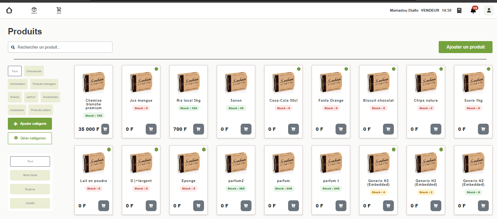
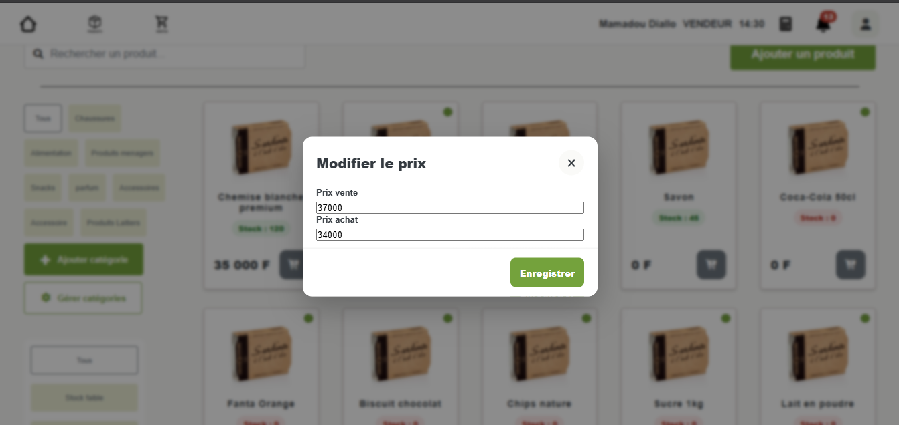
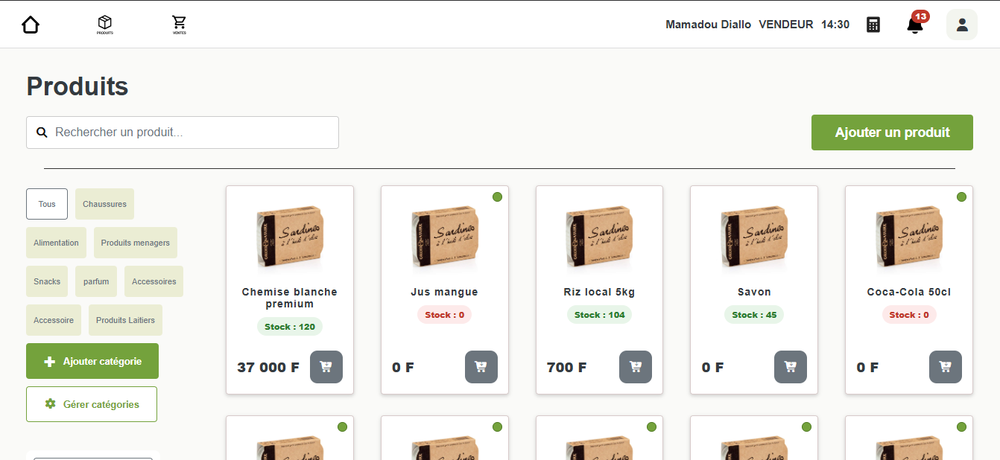
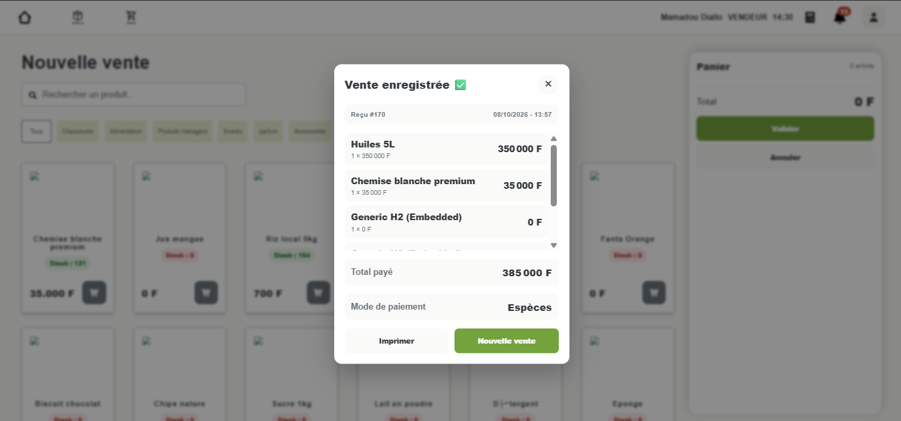
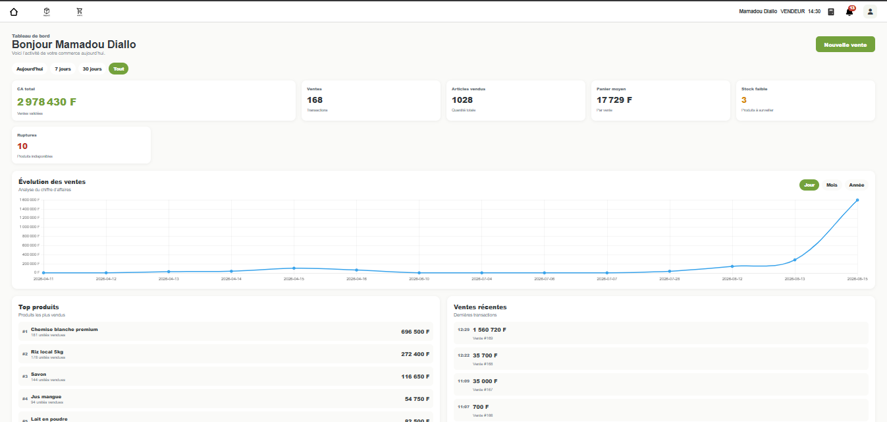

# 9. Tests et validation du MVP

## 9.1 Objectifs des tests

La phase de tests a pour objectif de vérifier le bon fonctionnement des fonctionnalités développées et de s’assurer que l’application répond correctement aux besoins identifiés lors de l’analyse.

Les tests réalisés visent à :

- valider les règles métier ;
- détecter les anomalies ;
- vérifier la cohérence des données ;
- garantir la stabilité de l’application ;
- sécuriser les évolutions futures.

Les scénarios de tests ont été construits à partir des principaux cas d’usage de l’application.

La stratégie de validation a évolué avec le projet. Le MVP a d’abord fait l’objet de validations fonctionnelles centrées sur les règles métier. Lors du passage à l’API REST puis à l’architecture microservices V2, ces validations ont été complétées par des tests automatisés, des tests d’intégration avec Postman, des tests de sécurité fonctionnelle et des tests de performance.

Le plan de tests détaillé de la V2 est conservé dans :

`docs/tests/plan-tests-v2.md`

---

## 9.2 Validation de l’authentification

Les tests réalisés sur le module d’authentification ont permis de vérifier :

- la connexion avec un PIN valide ;
- le refus de connexion avec un PIN invalide ;
- la création correcte de la session utilisateur ;
- l’affichage de l’utilisateur connecté ;
- la déconnexion.

**Résultat :**

L’ensemble des scénarios testés a été validé.

---

## 9.3 Validation de la gestion des utilisateurs

Les tests réalisés concernent :

- la création d’un utilisateur ;
- la modification d’un utilisateur ;
- l’activation ;
- la désactivation ;
- le contrôle de l’unicité du code PIN.

**Résultat :**

Les règles métier définies pour la gestion des utilisateurs sont respectées.

Les contraintes d’intégrité empêchent la création de codes PIN dupliqués.

---

## 9.4 Validation de la gestion des catégories

Les scénarios testés concernent :

- la création d’une catégorie ;
- la modification d’une catégorie ;
- l’activation ;
- la désactivation ;
- l’affichage des catégories dans les différents modules.

**Résultat :**

Les catégories sont correctement propagées dans les écrans produits et ventes.

---

## 9.5 Validation de la gestion des produits

Les tests réalisés ont permis de vérifier :

- la création d’un produit ;
- la modification d’un produit ;
- la gestion du stock ;
- les catégories ;
- l’activation ;
- la désactivation ;
- l’affichage des détails.

Une attention particulière a été portée à la cohérence des quantités disponibles et à leur évolution lors des opérations de stock et de vente.

**Résultat :**

La consultation du catalogue affiche les produits, leurs catégories, les prix de vente et les quantités en stock. La capture permet notamment d’identifier les produits en rupture ; les autres opérations de gestion mentionnées ci-dessus ne sont pas toutes démontrées par cette image.

*Figure 9.1 — Consultation du catalogue : produits, prix et niveaux de stock dans le MVP Thymeleaf.*

---

## 9.6 Validation de l’historique des prix

Le module `ProductPrice` a fait l’objet de tests spécifiques.

Les vérifications ont porté sur :

- la création d’un nouveau prix ;
- la clôture automatique de l’ancien prix ;
- la conservation de l’historique ;
- la récupération du prix actif.

**Résultat :**

Un seul prix actif est présent pour un produit à un instant donné.

L’historique des modifications est décrit par les règles métier et les validations réalisées, mais les captures ci-dessous attestent uniquement de la mise à jour visible du prix actif ; elles ne suffisent pas à prouver la conservation de l’ancien prix en base.

**Scénario illustré :** le produit « Chemise blanche premium » était affiché à **35 000 F** (figure 9.1). Le prix de vente est saisi à **37 000 F** et le prix d’achat à **34 000 F** ; après enregistrement, la fiche produit affiche **37 000 F**.

*Figure 9.2 — Saisie des nouveaux prix dans la fenêtre « Modifier le prix ».*

*Figure 9.3 — Nouveau prix actif affiché après enregistrement.*

Durant le développement, un cas d’erreur a notamment mis en évidence une violation de la contrainte d’unicité lors du remplacement du prix actif. La correction consiste à clôturer et enregistrer l’ancien prix puis à forcer la synchronisation avec la base avant l’insertion du nouveau prix.

Ce comportement fait désormais partie des scénarios couverts par les tests du `product-service`.

---

## 9.7 Validation du processus de vente

Le processus de vente constitue le scénario métier principal du projet.

Les tests réalisés concernent :

- l’ajout de produits à une vente ;
- la gestion des quantités ;
- la récupération du prix actif ;
- la validation d’une vente ;
- la création des lignes de vente ;
- la conservation du prix unitaire au moment de la transaction ;
- la décrémentation du stock.

**Résultat :**

L’interface confirme l’enregistrement de la vente et affiche un reçu détaillé. Le reçu **n° 170**, daté du **08/10/2026 à 13:57**, indique un total payé de **385 000 F** et un paiement en **espèces**. La capture atteste de la confirmation à l’écran ; la persistance en base et la décrémentation du stock nécessitent des vérifications distinctes.

*Figure 9.4 — Confirmation de vente et reçu affiché dans le MVP.*

---

## 9.8 Validation de la gestion du stock

Les tests réalisés concernent :

- l’ajout manuel de stock ;
- la décrémentation automatique après vente ;
- le contrôle de la quantité disponible.

**Résultat :**

Les quantités disponibles sont correctement mises à jour après les opérations testées.

---

## 9.9 Validation du tableau de bord

Les indicateurs du tableau de bord du MVP ont été comparés aux données enregistrées dans la base.

Les tests concernent :

- le chiffre d’affaires ;
- le nombre de ventes ;
- les articles vendus ;
- le panier moyen ;
- les produits les plus vendus ;
- les ventes récentes ;
- les alertes de stock.

Les filtres de période ont également été vérifiés.

**Résultat :**

Le tableau de bord affiche les principaux indicateurs commerciaux et leur représentation graphique : chiffre d’affaires, ventes, articles vendus, panier moyen, alertes de stock, évolution des ventes, produits les plus vendus et transactions récentes. La capture démontre leur affichage ; elle ne documente pas, à elle seule, la comparaison des valeurs avec la base.

*Figure 9.5 — Tableau de bord du MVP : indicateurs, courbe des ventes et produits les plus vendus.*

---

## 9.10 Difficultés rencontrées pendant les validations

Plusieurs difficultés ont été rencontrées pendant les validations du MVP.

Parmi les principales :

- la gestion de l’historique des prix ;
- la cohérence des agrégations du tableau de bord ;
- la gestion du stock après validation d’une vente ;
- l’organisation et la séparation des traitements métier ;
- la stabilisation de l’interface utilisateur ;
- la vérification des règles métier avant la migration vers l’API REST.

Ces difficultés ont été progressivement résolues grâce à une approche itérative : développement, test, correction puis nouvelle validation.

---

## 9.11 Bilan des validations du MVP

Les validations fonctionnelles du MVP ont porté sur l’authentification, les utilisateurs, les catégories, les produits, l’historisation des prix, le stock, les ventes et le tableau de bord. Elles ont accompagné la stabilisation des règles métier du monolithe avant les évolutions d’architecture.

La validation de la V2 est documentée au chapitre 15, après la présentation de la migration REST/React et des microservices. Les résultats détaillés figurent également dans `docs/tests/plan-tests-v2.md`.
