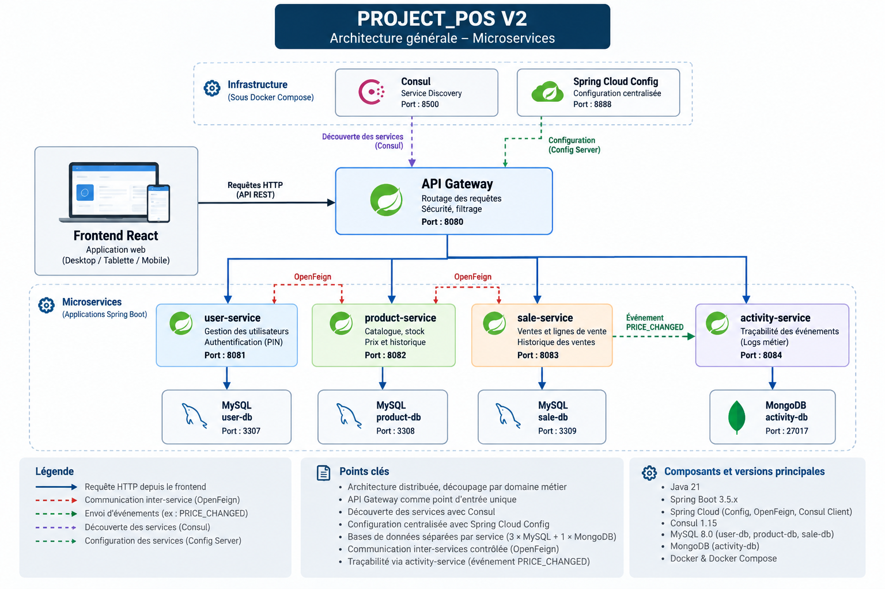

# 12. Architecture V2 : passage aux microservices

## 12.1 Objectifs de la V2

Après la séparation du frontend React et du backend REST réalisée pendant la V1, la deuxième évolution majeure du projet a consisté à faire évoluer le backend vers une architecture distribuée basée sur des microservices.

Cette évolution répond à deux objectifs complémentaires.

Le premier est architectural : expérimenter un découpage du système par domaines métier afin de réduire le couplage entre les différentes responsabilités de l'application.

Le second s'inscrit dans le cadre du titre professionnel Concepteur Développeur d'Applications. La V2 permet de mettre en œuvre plusieurs problématiques liées aux architectures distribuées, à la communication entre services, aux bases de données SQL et NoSQL, à la configuration centralisée, à la découverte de services, aux conteneurs et à l'intégration continue.

La V2 ne constitue pas une réécriture fonctionnelle de PROJECT_POS.

Les principales règles métier développées et validées dans les versions précédentes ont été conservées puis réparties entre plusieurs services spécialisés.

---

## 12.2 Découpage fonctionnel

L'analyse du domaine métier a conduit à identifier quatre services applicatifs principaux.

### user-service

Le `user-service` est responsable de la gestion des utilisateurs et de l'authentification.

Il prend notamment en charge :

- la création et la modification des utilisateurs ;
- la consultation des utilisateurs ;
- les rôles `VENDEUR` et `GERANT` ;
- l'authentification par code PIN ;
- la gestion de l'utilisateur connecté.

Le service utilise une base de données MySQL dédiée.

### product-service

Le `product-service` centralise les responsabilités liées au catalogue.

Il prend notamment en charge :

- les catégories ;
- les produits ;
- le stock ;
- le prix de vente ;
- le prix d'achat ;
- l'historique des prix.

La règle d'historisation des prix provenant du MVP est conservée.

Lorsqu'un prix est modifié, l'ancien prix est clôturé avant la création du nouveau prix actif.

Le service utilise également une base MySQL dédiée.

### sale-service

Le `sale-service` est responsable du processus de vente.

Il gère notamment :

- la création d'une vente ;
- les lignes de vente ;
- l'utilisateur ayant réalisé la vente ;
- l'historique des ventes ;
- le détail d'une vente.

Lors de la création d'une vente, le service communique avec d'autres microservices afin de récupérer les informations nécessaires.

Le prix unitaire utilisé lors de la vente reste enregistré dans `SaleItem`.

Cette règle garantit qu'une vente historique conserve son prix d'origine même si le prix du produit est modifié ultérieurement.

Le service possède sa propre base MySQL.

### activity-service

Le `activity-service` a été introduit afin de gérer la traçabilité de certains événements du système.

Contrairement aux trois services précédents, il utilise MongoDB.

Un événement d'activité contient notamment :

- un type d'événement ;
- une date ;
- l'utilisateur concerné lorsque cette information est disponible ;
- le service source ;
- le type d'entité concernée ;
- son identifiant ;
- des métadonnées complémentaires.

Les événements sont conçus comme des traces immuables.

Le service expose donc des opérations de création et de consultation, mais pas de modification ou de suppression des événements.

Ce choix correspond à la fonction de journalisation du service.

---

## 12.3 Base de données par service

L'un des changements importants par rapport au monolithe concerne la gestion des données.

Dans le MVP, les différents domaines partageaient une même base MySQL.

Dans la V2, chaque service SQL possède sa propre base :

```text
user-service
    ↓
pos_user_db

product-service
    ↓
pos_product_db

sale-service
    ↓
pos_sale_db
```

Le `activity-service` utilise séparément :

```text
activity-service
    ↓
pos_activity_db (MongoDB)
```

Cette séparation évite qu'un microservice accède directement aux tables appartenant à un autre domaine.

Par conséquent, les relations qui existaient auparavant sous la forme de clés étrangères entre certains domaines deviennent des références par identifiant.

Par exemple, une vente conserve l'identifiant de l'utilisateur et les lignes de vente conservent les identifiants des produits, mais `sale-service` ne possède pas de clé étrangère SQL vers les bases de `user-service` ou `product-service`.

Lorsque des informations complémentaires sont nécessaires, elles sont récupérées par communication inter-service.

---

## 12.4 Communication entre microservices

Les services communiquent par API HTTP REST.

Spring Cloud OpenFeign est utilisé pour simplifier certains appels entre services.

Le `sale-service` communique notamment avec :

- `user-service` pour obtenir les informations concernant l'utilisateur ;
- `product-service` pour obtenir les informations d'un produit et mettre à jour son stock.

Lors de la création d'une vente, le processus comprend notamment les opérations suivantes :

1. identifier l'utilisateur connecté ;
2. récupérer les informations du produit ;
3. vérifier les informations nécessaires à la vente ;
4. décrémenter le stock via `product-service` ;
5. enregistrer la vente et ses lignes dans `sale-service`.

Le prix unitaire enregistré dans la ligne de vente correspond au prix récupéré au moment de l'opération.

Cette communication permet de respecter la séparation des responsabilités : `sale-service` ne modifie jamais directement la base de données de `product-service`.

### Implémentation des clients inter-services

Les communications nécessaires au processus de vente sont déclarées avec Spring Cloud OpenFeign. Les services sont référencés par leur nom logique plutôt que par une adresse codée directement dans le client.

**Fichiers sources :**

- `ProductClient.java` — interface OpenFeign permettant à `sale-service` de communiquer avec `product-service`.
- `UserClient.java` — interface OpenFeign permettant à `sale-service` de communiquer avec `user-service`.

**Emplacements :** `microservices/sale-service/src/main/java/com/projectpos/saleservice/`
```java
@FeignClient(name = "product-service")
public interface ProductClient {

    @GetMapping("/api/v1/products/{id}")
    ProductResponse findById(@PathVariable("id") Integer id);

    @PostMapping("/api/v1/products/stock/remove")
    void removeStock(@RequestBody RemoveStockRequest request);
}
```

Le même principe est utilisé pour communiquer avec user-service. La session HTTP actuelle est propagée lors de la récupération de l'utilisateur connecté :

```java
@FeignClient(name = "user-service")
public interface UserClient {

    @GetMapping("/api/v1/auth/me")
    CurrentUserResponse getCurrentUser(
            @RequestHeader("Cookie") String cookie
    );
}
```

Ces interfaces séparent le code métier de sale-service des détails techniques de construction des appels HTTP. Associées à la découverte de services avec Consul, elles permettent d'utiliser les noms logiques product-service et user-service.


### Exemple d'orchestration : création d'une vente

La création d'une vente illustre concrètement la communication entre les domaines `sale` et `product`.


Cet extrait présente l'orchestration d'une vente : récupération des informations produit, retrait du stock par appel interservices et conservation du prix unitaire dans la ligne de vente.
Pour chaque ligne demandée, `sale-service` interroge `product-service` afin d'obtenir les informations du produit et son prix actif. Il demande ensuite au service propriétaire du stock d'effectuer le retrait.

**Fichier source :** `microservices/sale-service/src/main/java/com/projectpos/saleservice/sale/service/SaleService.java`
```java
ProductResponse product =
        productClient.findById(itemRequest.productId());

if (product.salePrice() == null) {
    throw new IllegalArgumentException(
            "Aucun prix actif pour " + product.name()
    );
}

productClient.removeStock(
        new RemoveStockRequest(
                itemRequest.productId(),
                itemRequest.quantity()
        )
);

SaleItem item = new SaleItem();

item.setSale(sale);
item.setProductId(product.id());
item.setQuantity(itemRequest.quantity());
item.setUnitPrice(product.salePrice());

sale.getItems().add(item);
```

Cet extrait montre que `sale-service` ne modifie pas directement les données appartenant à `product-service`. La communication passe par l'API du service propriétaire au moyen du client inter-service.

Le prix retourné au moment de la vente est copié dans `SaleItem.unitPrice`. Il devient ainsi une donnée historique de la vente : une modification ultérieure du prix du produit ne modifie pas les transactions déjà enregistrées.

> **Limite connue de la V2 :** le retrait du stock dans `product-service` et l'enregistrement de la vente dans `sale-service` appartiennent à deux transactions distinctes. Si le retrait du stock réussit mais que l'enregistrement de la vente échoue ensuite, aucune transaction SQL globale ne permet actuellement d'annuler automatiquement le retrait. Cette limite est étudiée plus en détail dans la section 12.10.

---

## 12.5 API Gateway

Une API Gateway a été ajoutée comme point d'entrée principal de l'architecture.

Le service :

```text
api-gateway
```

est accessible sur le port :

```text
8080
```

Il route les requêtes vers les services concernés.

Les principales routes concernent :

```text
/api/v1/users/**
/api/v1/auth/**
/api/v1/products/**
/api/v1/categories/**
/api/v1/sales/**
/api/v1/activities/**
```

Le frontend n'a donc pas besoin de connaître directement les ports internes de chaque microservice.

L'API Gateway fournit un point d'entrée commun vers le backend distribué.

---

## 12.6 Découverte de services avec Consul

Dans une architecture distribuée, l'adresse d'un service ne doit pas nécessairement être codée directement dans les autres applications.

Consul a été intégré afin de fournir un mécanisme de découverte de services.

Au démarrage, les applications s'enregistrent auprès de Consul.

Les services applicatifs enregistrés sont notamment :

```text
user-service
product-service
sale-service
activity-service
api-gateway
```

Cette découverte est utilisée conjointement avec les noms logiques des services pour permettre leur résolution lors des communications.

Elle évite de faire dépendre l'architecture uniquement de ports et d'adresses configurés directement dans le code.

---

## 12.7 Configuration centralisée

Un Config Server Spring Cloud a également été mis en place.

Son rôle est de centraliser les configurations des différents services.

Le serveur de configuration utilise un dépôt Git dédié contenant les configurations distantes.

L'architecture sépare ainsi :

- le code source des applications ;
- leur configuration ;
- les valeurs propres à l'environnement d'exécution.

Les services récupèrent leur configuration au démarrage auprès du Config Server.

Cette organisation facilite la maintenance de plusieurs services partageant une infrastructure commune.

Les informations sensibles ne doivent cependant pas être stockées directement en clair dans le dépôt de configuration.

Les secrets nécessaires à l'exécution sont injectés par variables d'environnement.

---

## 12.8 Architecture générale

L'architecture logique de la V2 est représentée dans le schéma suivant :



**Figure — Architecture générale de PROJECT_POS V2.** Le frontend accède au backend par l'API Gateway. Les responsabilités métier sont réparties entre `user-service`, `product-service`, `sale-service` et `activity-service`. Les trois services transactionnels disposent chacun de leur propre base MySQL, tandis que `activity-service` utilise MongoDB. Consul assure la découverte des services et Spring Cloud Config centralise leur configuration.

Les communications inter-services restent contrôlées par les frontières métier. `sale-service` communique avec `user-service` et `product-service` via OpenFeign. `product-service` communique avec `activity-service` pour transmettre l'événement `PRICE_CHANGED` lors d'une modification de prix.

Aucun service métier n'accède directement à la base de données d'un autre service.
---

## 12.9 Environnement d'exécution de développement

Pendant le développement de la V2, l'infrastructure est exécutée avec Docker Compose.

Les conteneurs comprennent :

- Consul ;
- Config Server ;
- trois instances MySQL ;
- MongoDB.

Les services applicatifs peuvent être démarrés depuis l'environnement de développement IntelliJ IDEA afin de conserver un cycle de développement et de débogage rapide.

Les ports utilisés sont :

| Composant | Port |
|---|---:|
| API Gateway | 8080 |
| user-service | 8081 |
| product-service | 8082 |
| sale-service | 8083 |
| activity-service | 8084 |
| Config Server | 8888 |
| Consul | 8500 |
| user-db | 3307 |
| product-db | 3308 |
| sale-db | 3309 |
| MongoDB | 27017 |

Cette organisation constitue l'environnement de développement de la V2 et non une architecture de production définitive.

---

## 12.10 Gestion des transactions distribuées

Le passage aux microservices introduit de nouvelles contraintes qui n'existaient pas de la même manière dans le monolithe.

La création d'une vente constitue un exemple important.

Le `sale-service` demande à `product-service` de décrémenter le stock avant d'enregistrer définitivement la vente dans sa propre base.

Ces opérations utilisent deux bases de données indépendantes.

Il n'existe donc plus de transaction SQL unique couvrant l'ensemble du processus.

Une situation théorique peut alors se produire :

```text
décrémentation du stock réussie
            ↓
échec de l'enregistrement de la vente
```

Le stock aurait alors été modifié alors que la vente n'aurait pas été enregistrée.

Cette limite est connue et assumée dans le périmètre actuel de la V2.

Dans une architecture destinée à une exploitation plus importante, plusieurs stratégies pourraient être étudiées :

- transaction distribuée par Saga ;
- opération compensatoire ;
- publication d'événements ;
- Outbox Pattern ;
- traitement asynchrone avec système de messagerie.

L'objectif de la V2 était d'identifier et de comprendre cette problématique sans introduire prématurément une infrastructure supplémentaire.

---

## 12.11 Tolérance aux erreurs du journal d'activité

L'intégration de `activity-service` introduit également une décision architecturale particulière.

Par exemple, lorsqu'un prix est modifié, `product-service` peut transmettre un événement `PRICE_CHANGED` à `activity-service`.

La journalisation ne doit cependant pas empêcher l'opération métier principale de réussir si le service d'activité est temporairement indisponible.

L'appel est donc traité de manière à ne pas faire échouer la modification du prix en cas d'indisponibilité du service de journalisation.

Cette stratégie privilégie la disponibilité de l'opération métier.

Elle présente toutefois une limite : l'événement perdu n'est actuellement pas rejoué automatiquement.

Une évolution future pourrait introduire un mécanisme fiable de publication et de reprise des événements.

---

## 12.12 Bilan architectural

La V2 transforme PROJECT_POS en une architecture distribuée composée de services spécialisés.

Le passage aux microservices a permis de mettre en pratique :

- le découpage d'un domaine métier ;
- l'isolation des données par service ;
- les communications REST inter-services ;
- OpenFeign ;
- la découverte de services avec Consul ;
- la configuration centralisée avec Spring Cloud Config ;
- l'utilisation conjointe de MySQL et MongoDB ;
- un point d'entrée commun avec API Gateway ;
- l'exécution d'une infrastructure conteneurisée.

Cette architecture apporte davantage de séparation entre les domaines mais introduit également une complexité supérieure au monolithe.

Cette complexité concerne notamment les communications réseau, la configuration distribuée, la disponibilité des services et la cohérence des opérations impliquant plusieurs bases de données.

Le choix de la V2 a donc été réalisé dans une démarche d'apprentissage et d'évolution architecturale maîtrisée, et non parce qu'une architecture microservices serait systématiquement préférable à un monolithe.

La V2 constitue finalement l'aboutissement technique du projet présenté dans ce dossier et sert de support aux problématiques de sécurité, de persistance SQL/NoSQL, de tests, de déploiement et de DevOps présentées dans les chapitres suivants.