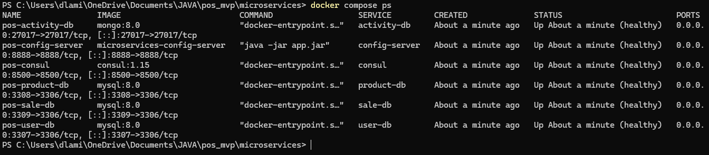
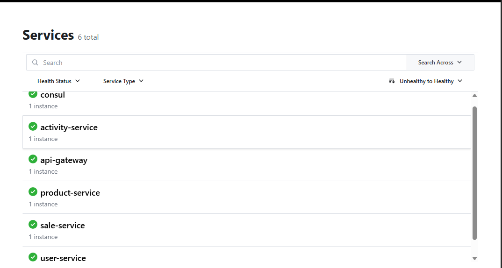
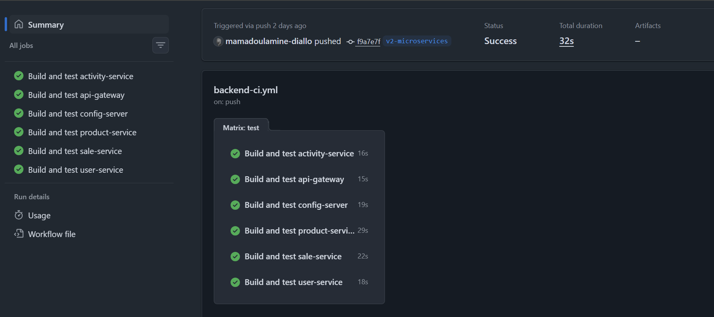

# 15. Déploiement, tests et démarche DevOps

## 15.1 Objectifs

Le passage de PROJECT_POS à une architecture distribuée a nécessité de faire évoluer l'environnement d'exécution et les procédures de validation.

Dans le MVP, l'application pouvait être exécutée comme une application Spring Boot unique connectée à une base MySQL.

La V2 comporte plusieurs applications et composants d'infrastructure :

- `user-service` ;
- `product-service` ;
- `sale-service` ;
- `activity-service` ;
- `api-gateway` ;
- `config-server` ;
- Consul ;
- trois bases MySQL ;
- MongoDB.

Cette architecture nécessite une démarche permettant :

- de reproduire l'environnement ;
- de vérifier l'état des composants ;
- de gérer les configurations ;
- de protéger les secrets ;
- d'automatiser les tests ;
- de détecter les régressions ;
- de valider le fonctionnement global du système.

Docker Compose, Maven et GitHub Actions ont été utilisés pour répondre à ces besoins.

---

## 15.2 Organisation de l'environnement V2

L'environnement de développement est organisé en deux parties.

L'infrastructure technique est exécutée avec Docker Compose.

Les services applicatifs peuvent être lancés depuis IntelliJ IDEA afin de conserver un cycle de développement et de débogage rapide.

L'organisation utilisée pendant le développement est donc :

```text
Docker Compose
│
├── Consul
├── Config Server
├── user-db
├── product-db
├── sale-db
└── activity-db

IntelliJ IDEA
│
├── user-service
├── product-service
├── sale-service
├── activity-service
└── api-gateway
```

Cette organisation constitue un environnement de développement et de validation.

Elle ne représente pas une architecture de production définitive.

---

## 15.3 Infrastructure Docker Compose

Le fichier principal d'infrastructure est :

```text
microservices/docker-compose.yml
```

Il permet de démarrer les composants nécessaires à la V2.

Les conteneurs principaux sont :

```text
pos-consul
pos-config-server
pos-user-db
pos-product-db
pos-sale-db
pos-activity-db
```

Les ports utilisés pendant le développement sont notamment :

| Composant | Port hôte |
|---|---:|
| Consul | 8500 |
| Config Server | 8888 |
| user-db | 3307 |
| product-db | 3308 |
| sale-db | 3309 |
| MongoDB | 27017 |

Les services applicatifs utilisent :

| Service | Port |
|---|---:|
| API Gateway | 8080 |
| user-service | 8081 |
| product-service | 8082 |
| sale-service | 8083 |
| activity-service | 8084 |

---

## 15.4 Persistance des données Docker

Les bases de données utilisent des volumes Docker nommés.

Cette configuration permet de conserver les données lorsque les conteneurs sont arrêtés ou recréés.

La procédure suivante a notamment été testée :

```bash
docker compose down
docker compose up -d
```

L'option de suppression des volumes n'est volontairement pas utilisée lors d'un redémarrage normal.

Les bases peuvent ainsi être recréées sous forme de conteneurs sans perdre automatiquement leurs données persistantes.

Cette distinction est importante entre :

```text
cycle de vie du conteneur
```

et :

```text
cycle de vie des données
```

---

## 15.5 Gestion des variables d'environnement

Une première version de l'infrastructure contenait directement un secret MySQL dans le fichier Docker Compose.

Cette configuration a été corrigée.

Le fichier Compose utilise désormais une variable :

```text
${MYSQL_ROOT_PASSWORD}
```

La valeur locale est fournie par :

```text
microservices/.env
```

Ce fichier est exclu du versionnement Git.

Les configurations distantes des services SQL utilisent également :

```text
${MYSQL_ROOT_PASSWORD}
```

La valeur réelle est injectée dans l'environnement d'exécution des services.

Cette organisation permet de conserver les fichiers de configuration dans Git sans y enregistrer le secret actuellement utilisé.

Lorsqu'un ancien secret a été identifié comme ayant été exposé dans l'historique Git, il a été remplacé.

---

## 15.6 Contrôles de santé

Des `healthchecks` Docker ont été ajoutés aux composants de l'infrastructure.

Ils permettent à Docker de distinguer un conteneur simplement démarré d'un composant réellement capable de répondre au contrôle prévu.

Les trois instances MySQL utilisent un contrôle basé sur `mysqladmin ping`.

MongoDB utilise une commande de type :

```text
db.adminCommand('ping')
```

Consul utilise :

```text
consul members
```

Le Config Server est contrôlé à travers son endpoint de santé.

À l'issue de la validation de l'infrastructure, les six composants Docker étaient dans un état sain :

```text
6 / 6 healthy
```

Ces contrôles améliorent la visibilité sur l'état de l'environnement et permettent également de gérer certaines dépendances de démarrage.

La vérification suivante a été réalisée après le démarrage complet de l'infrastructure :



**Figure — Vérification de l'infrastructure V2 avec Docker Compose.** Les six conteneurs d'infrastructure (`Consul`, `Config Server`, trois instances MySQL et MongoDB) sont démarrés et déclarés `healthy` par leurs healthchecks.
---

## 15.7 Ordre de démarrage

Le démarrage de la V2 nécessite de tenir compte des dépendances entre composants.

L'infrastructure est démarrée en premier :

```text
Docker Compose
      |
      v
Consul + bases de données
      |
      v
Config Server
```

Les applications Spring Boot peuvent ensuite être lancées :

```text
user-service
product-service
sale-service
activity-service
api-gateway
```

Après leur démarrage, les services sont visibles dans Consul.

Lors de la campagne de validation, les cinq applications enregistrées auprès de Consul étaient opérationnelles.

Cette vérification permet de confirmer le fonctionnement du mécanisme de découverte de services.

La vérification dans l'interface Consul confirme l'enregistrement des cinq applications de la V2 :



**Figure — Découverte des services de l'architecture V2 avec Consul.** Les cinq applications (`user-service`, `product-service`, `sale-service`, `activity-service` et `api-gateway`) sont enregistrées dynamiquement dans le registre et apparaissent en état sain.
---

## 15.8 Point d'entrée de l'application

L'API Gateway constitue le point d'entrée principal du backend V2.

Elle est accessible sur :

```text
http://localhost:8080
```

Les requêtes sont ensuite routées vers le service correspondant.

Un test simple de validation du déploiement a notamment consisté à appeler :

```text
GET /api/v1/products
```

à travers la Gateway.

La réponse HTTP `200` obtenue a permis de vérifier plusieurs composants de la chaîne :

```text
client
  ↓
API Gateway
  ↓
découverte du service
  ↓
product-service
  ↓
base de données
  ↓
réponse
```

Ce test constitue un smoke test du système après démarrage.

---

## 15.9 Stratégie de tests

La validation de la V2 ne repose pas uniquement sur des tests manuels.

Plusieurs niveaux de tests ont été utilisés :

- tests automatisés des services ;
- tests de contrôleurs ;
- tests fonctionnels des API ;
- tests inter-services ;
- tests système ;
- tests de sécurité fonctionnelle ;
- tests de performance locaux ;
- tests de redémarrage de l'infrastructure.

Un plan de tests spécifique à la V2 a été rédigé dans :

```text
docs/tests/plan-tests-v2.md
```

Il conserve les résultats de la campagne de validation.

---

## 15.10 Tests automatisés

Des tests automatisés ont été mis en place sur les principaux services métier.

Les campagnes ciblées ont notamment couvert :

```text
product-service       8 tests métier
sale-service          4 tests métier
user-service          6 tests métier
activity-service      4 tests contrôleur
```

Soit :

```text
22 tests ciblés
```

auxquels s'ajoutent les tests de chargement des contextes Spring utilisés par les différents projets.

Les tests couvrent notamment :

- la logique utilisateur ;
- la logique produit ;
- la gestion des prix ;
- la création des ventes ;
- la validation des événements d'activité ;
- les filtres du journal d'activité.

---

## 15.11 Isolation des tests SQL

La mise en place de l'intégration continue a révélé que certains tests dépendaient implicitement des bases MySQL locales.

Cette dépendance empêchait leur exécution correcte dans un environnement CI vierge.

Les services :

```text
user-service
product-service
sale-service
```

utilisent désormais une base H2 en mémoire pour les tests nécessitant un contexte Spring.

Chaque service dispose d'une configuration de test spécifique sous :

```text
src/test/resources/application-test.yml
```

Le profil `test` désactive également les dépendances Spring Cloud qui ne sont pas nécessaires pendant ces tests.

Cette modification rend les tests indépendants des bases MySQL du poste de développement.

---

## 15.12 Isolation des composants Spring Cloud

D'autres problèmes ont été révélés lors de l'exécution du pipeline sur GitHub Actions.

`api-gateway` et `activity-service` tentaient notamment de charger une configuration distante alors que le Config Server n'était pas disponible sur le runner.

Des profils de test ont donc été ajoutés afin de désactiver :

```text
Spring Cloud Config
Consul
```

lorsqu'ils ne sont pas nécessaires aux tests concernés.

Pour `config-server`, une stratégie différente a été utilisée.

Le profil de test active le backend :

```text
native
```

afin que le contexte puisse démarrer sans dépendre du dépôt Git distant de configuration.

Cette isolation a rendu les six applications Maven testables dans un environnement CI indépendant.

---

## 15.13 Tests fonctionnels et inter-services

Les API ont également été testées avec Postman.

La campagne de tests a notamment permis de valider :

```text
Authentification
├── login valide
├── utilisateur courant
└── PIN invalide

Produits
├── liste
├── consultation
├── ajout de stock
├── vérification du stock
├── changement de prix
├── prix actif
└── historique des prix

Activités
└── événement PRICE_CHANGED via Gateway

Ventes
├── création d'une vente
├── décrémentation du stock
└── consultation du détail

Sécurité fonctionnelle
└── création d'une vente sans session refusée
```

La création d'une vente permet notamment de vérifier une chaîne impliquant plusieurs services.

---

## 15.14 Incident détecté pendant les tests système

Les tests système ont permis d'identifier un défaut réel de configuration.

Lors de la vérification de `activity-service` à travers l'API Gateway, la route correspondante était absente de la configuration de la Gateway.

La route :

```text
/api/v1/activities/**
```

a donc été ajoutée vers :

```text
lb://activity-service
```

Après correction, les appels au journal d'activité à travers la Gateway ont fonctionné.

Cet incident montre l'intérêt des tests système : chaque composant pouvait fonctionner isolément alors que le parcours complet présentait encore un défaut d'intégration.

---

## 15.15 Test de sécurité fonctionnelle

Un scénario a également vérifié le comportement d'une opération protégée en l'absence de session valide.

Une tentative de création de vente sans authentification retourne :

```text
HTTP 401
```

avec une réponse indiquant que la session est invalide ou expirée.

Ce test vérifie que la protection n'est pas uniquement implémentée dans l'interface React.

Le backend refuse lui-même l'opération lorsqu'il ne peut pas identifier un utilisateur authentifié.

---

## 15.16 Tests de performance locaux

Des tests de charge ont été réalisés sur l'environnement local.

Ils n'ont pas pour objectif de déterminer la capacité de production de PROJECT_POS.

La machine utilisée héberge simultanément :

- le système testé ;
- les bases de données ;
- l'infrastructure ;
- le générateur de charge.

Les résultats doivent donc être interprétés comme des mesures locales permettant principalement d'observer le comportement de l'application.

### Scénario 1 : un utilisateur virtuel

Sur une durée d'environ une minute :

```text
Requêtes :      853
Débit :         14,24 req/s
Temps moyen :   16 ms
P90 :           22 ms
P95 :           27 ms
P99 :           33 ms
Échecs :        0
CPU maximum :   47,8 %
RAM observée :  95,3 %
```

### Scénario 2 : trois utilisateurs virtuels

Sur une durée d'environ une minute :

```text
Requêtes :      4033
Débit :         67,53 req/s
Temps moyen :   15 ms
P90 :           19 ms
P95 :           23 ms
P99 :           45 ms
Échecs :        0
CPU maximum :   74,5 %
RAM observée :  91 %
```

Aucune erreur n'a été observée pendant ces deux campagnes valides.

Compte tenu de l'utilisation importante de la mémoire et du fait que le générateur de charge partageait la même machine que l'application, il n'a pas été jugé pertinent d'augmenter davantage la charge.

Ces résultats ne doivent pas être présentés comme un dimensionnement de production.

---

## 15.17 Mise en place de l'intégration continue

Une chaîne d'intégration continue a été mise en place avec GitHub Actions.

Le workflow se trouve dans :

```text
.github/workflows/backend-ci.yml
```

Il s'exécute lors :

```text
d'un push sur v2-microservices
```

ou :

```text
d'une pull request vers v2-microservices
```

Le pipeline utilise une matrice afin de traiter indépendamment les six applications Maven :

```text
activity-service
api-gateway
config-server
product-service
sale-service
user-service
```

Chaque service dispose donc de son propre job de compilation et de test.

---

## 15.18 Environnement CI

L'environnement GitHub Actions final utilise :

```text
Ubuntu 24.04
Java 21
Temurin
Maven Wrapper
cache Maven
```

Le workflow utilise également des versions récentes des actions nécessaires à la préparation du runner.

Pour chaque microservice, la commande principale est :

```bash
chmod +x mvnw
./mvnw clean verify
```

Le Maven Wrapper garantit que l'exécution ne dépend pas d'une installation Maven particulière sur le runner.

---

## 15.19 Premier incident CI : Maven Wrapper

La première exécution du pipeline n'a pas réussi immédiatement.

Les six jobs ont rencontré un problème lié aux permissions du Maven Wrapper sur Linux.

Le runner retournait un code de sortie :

```text
126
```

Le fichier `mvnw` n'était pas exécutable.

La correction a consisté à ajouter :

```bash
chmod +x mvnw
```

avant l'exécution du wrapper.

Ce problème n'apparaissait pas dans l'environnement Windows utilisé pour le développement.

L'exécution sur un système Linux indépendant a donc révélé un problème de portabilité.

---

## 15.20 Deuxième série d'incidents CI

Après la correction du Maven Wrapper, les services SQL ont révélé leur dépendance implicite à l'environnement MySQL local.

Les profils H2 décrits précédemment ont permis de résoudre ce problème.

D'autres services ont ensuite révélé leur dépendance au Config Server :

```text
No spring.config.import set
```

Les profils de test ont permis d'isoler :

```text
api-gateway
activity-service
```

de cette dépendance pendant les tests.

Enfin, `config-server` nécessitait normalement un dépôt Git configuré.

L'utilisation du profil `native` pendant les tests a permis de supprimer cette dépendance externe.

La résolution de ces erreurs a progressivement rendu le pipeline reproductible sur un runner vierge.

---

## 15.21 Résultat final de la CI

Après les différentes corrections, le pipeline GitHub Actions a été exécuté avec succès.

Résultat :

```text
activity-service  ✅
api-gateway       ✅
config-server     ✅
product-service   ✅
sale-service      ✅
user-service      ✅
```

Soit :

```text
6 / 6 jobs validés
```

Ce résultat permet de vérifier automatiquement qu'une modification poussée sur la branche V2 ne casse pas la compilation ou les tests des six applications Maven.

La documentation technique détaillée de cette chaîne est conservée dans :

```text
docs/devops/ci-v2.md
```
L'exécution suivante montre le résultat final obtenu après correction des différents problèmes rencontrés pendant la mise en place de la CI :



**Figure — Pipeline d'intégration continue de la V2 avec GitHub Actions.** Le workflow `backend-ci.yml`, déclenché sur la branche `v2-microservices`, compile et teste indépendamment les six applications Maven. Cette exécution se termine avec succès pour l'ensemble de la matrice.
---

## 15.22 Apport de la démarche DevOps

L'intérêt de cette démarche ne réside pas uniquement dans l'utilisation de Docker ou de GitHub Actions.

La mise en place de la CI a révélé plusieurs problèmes qui étaient masqués par l'environnement de développement :

- permissions différentes entre Windows et Linux ;
- dépendance implicite aux bases MySQL locales ;
- dépendance implicite au Config Server ;
- dépendance du Config Server à son dépôt distant.

Le pipeline n'a donc pas seulement automatisé une commande qui fonctionnait déjà.

Il a permis d'améliorer la reproductibilité des applications.

Le cycle obtenu est :

```text
Développement
     ↓
Tests locaux
     ↓
Commit Git
     ↓
Push
     ↓
GitHub Actions
     ↓
Build + tests des 6 applications
     ↓
Validation ou détection d'une régression
```

---

## 15.23 Limites du déploiement actuel

La démarche mise en place correspond principalement à de l'intégration continue.

Elle ne constitue pas encore une chaîne complète de déploiement continu en production.

Les services applicatifs ne sont notamment pas tous construits automatiquement sous forme d'images Docker publiées dans un registre.

Il n'existe pas non plus d'environnement distant de recette ou de production alimenté automatiquement par la CI.

Une évolution future pourrait ajouter :

```text
GitHub Actions
      ↓
Tests
      ↓
Construction images Docker
      ↓
Registre d'images
      ↓
Déploiement environnement de recette
      ↓
Tests post-déploiement
      ↓
Validation
      ↓
Production
```

Cette évolution n'a pas été retenue dans le périmètre actuel afin de privilégier une chaîne d'intégration fiable et réellement maîtrisée.

---

## 15.24 Procédure synthétique de validation de la V2

La procédure utilisée pour valider l'environnement peut être résumée ainsi.

### 1. Démarrer l'infrastructure

Depuis :

```text
PROJECT_POS/microservices/
```

exécuter :

```bash
docker compose up -d
```

### 2. Vérifier les conteneurs

Exécuter :

```bash
docker compose ps
```

Les composants d'infrastructure doivent atteindre leur état attendu, notamment les services disposant d'un healthcheck.

### 3. Démarrer les applications

Démarrer :

```text
user-service
product-service
sale-service
activity-service
api-gateway
```

### 4. Vérifier Consul

Les cinq applications doivent apparaître enregistrées et opérationnelles dans Consul.

### 5. Vérifier la Gateway

Effectuer un smoke test :

```text
GET http://localhost:8080/api/v1/products
```

La réponse attendue est :

```text
HTTP 200
```

### 6. Exécuter les tests

Chaque application Maven peut être validée avec :

```bash
./mvnw clean verify
```

Sur Windows :

```powershell
.\mvnw.cmd clean verify
```

### 7. Vérifier la CI

Après un push sur la branche :

```text
v2-microservices
```

les six jobs GitHub Actions doivent être exécutés.

---

## 15.25 Bilan

La préparation du déploiement de PROJECT_POS V2 a permis de passer d'un environnement principalement manuel à une organisation plus reproductible.

Le projet dispose désormais :

- d'une infrastructure Docker Compose ;
- de volumes persistants ;
- de contrôles de santé ;
- d'une configuration centralisée ;
- d'une externalisation des secrets ;
- d'une procédure de démarrage et de validation ;
- d'un plan de tests ;
- de tests automatisés ;
- de tests fonctionnels et système ;
- de mesures de performance locales ;
- d'une chaîne d'intégration continue.

Les difficultés rencontrées pendant la mise en place de la CI ont également constitué une partie importante de la démarche.

Elles ont permis d'identifier puis de supprimer plusieurs dépendances implicites à la machine de développement.

La V2 dispose ainsi d'une base reproductible et testable qui pourrait être prolongée ultérieurement vers une véritable chaîne de livraison et de déploiement continu.